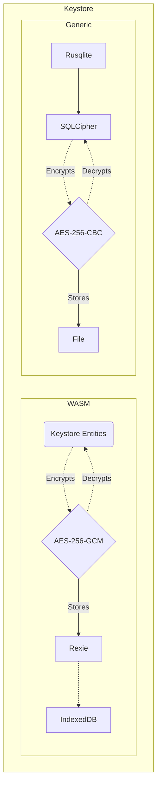

# CoreCrypto Keystore Implementation

## Goals

* Some sort of persistent data storage layer
* Encryption at-rest of the persisted keying material
* Compatibility with target libraries storage traits (i.e. OpenMLS & Proteus)
* Compatibility with our preferred targets (native, iOS, Android, Web browsers via WebAssembly)

## Targets

### Native - iOS - Android (aka Generic)

Nothing very fancy, pretty much everything is handed off to SQLCipher

* Backing store: Encrypted SQLite database (with [SQLCipher](https://www.zetetic.net/sqlcipher/))
* Encryption: AES256-CBC with per-page IV (provided by [SQLCipher](https://www.zetetic.net/sqlcipher/)).
    * Value-Level Encryption is also possible on the [Commercial or Enterprise editions](https://www.zetetic.net/sqlcipher/value-level-encryption/) if we want additional security guarantees
* Crypto primitives provider: [OpenSSL](https://www.openssl.org/)
* PRNG provider: [OpenSSL](https://www.openssl.org/)

### WASM

* Backing store: `IndexedDB` (with the [`rexie`](https://crates.io/crates/rexie) crate)
* Encryption: AES256-GCM Value-Level-Encryption with random, non-reused 96-bits nonces and embedded authentication tag (AAD) of the AEAD
    * Caveat: Primary IDs are not encrypted, as this would compromise lookup and cause whole table  
      scans. It is thus not recommended to store sensitive or identifying data in the primary ID.
    * Caveat: Indexed searches do work, in two steps, an optimistic step fetching an unencrypted record,  
      and a fallback step iterating on all records, decrypting the targeted field and checking it. Worst case it will run a whole table scan.
* Crypto primitives provider: RustCrypto - [`aes-gcm`](https://crates.io/crates/aes-gcm) crate
* PRNG provider: [`rand`](https://crates.io/crates/rand) crate with [`getrandom`](https://crates.io/crates/getrandom) (uses [Crypto.getRandomValues](https://www.w3.org/TR/WebCryptoAPI/#Crypto-method-getRandomValues) under the hood)

## Implementation details

### Overview

### Native

See [SQLCipher design](https://www.zetetic.net/sqlcipher/design/)

Summary:
* SQLCipher's file page size by default is 4096 bytes
* When using a passphrase (our case), the provided passphrase is derived using PBKDF2-HMAC-SHA512.  
  The salt of this KDF is stored in the 16 first bytes of the file.
    * Note: This cannot be kept as-is on iOS as iOS needs to be able to read the first 16-32 bytes of SQLite databases to "magically" guess they are SQLite databases 
     and to allow reading them from the background. This is very useful in the case of background work on iOS such as encrypted data in notifications needing access to the keystore. 
     It's also used for working with a Watch App.
* Each page is encrypted or decrypted on-the-fly using AES256-CBC
    * Provided by OpenSSL -`v1.1.1p` as of 29/06/22- in our case, but the crypto provider can be changed to NSS, LibTomCrypt or Security.framework
* Each page is written with a unique, random IV (*initialization vector*). This IV is regenerated on each page write. This IV is appended at the end of each page.
* Page ciphertexts are authenticated using an authentication tag using HMAC-SHA512. This tag is also appended at the each of the page.

### WASM

#### How the value-level encryption works

* The store key is hashed using SHA256 to always produce 32 bytes. AES256 requires keys to be exactly 32 bytes  
  so that's a way to transform a passphrase into a concrete key.
* Entities (i.e. Models in an ORM environment) dictate which fields are encrypted and with which AAD  
  through their implementation of the `Entity` trait.
* By default, the AAD is the primary ID of the IndexedDB collection (i.e Table in a SQL database environment)
* AES256-GCM is used to encrypt the aforementioned fields
    * A random 96-bit (12 bytes) Nonce is generated
    * The AAD is fetched through `Entity::aad()`
    * Together they are fed to [`aes-gcm`](https://crates.io/crates/aes-gcm) to create a ciphertext with embedded authentication tag
* The ciphertext is then stored along with its nonce with the following data layout:
    * Cleartext: A buffer of N bytes (`[u8; N]`)
    * Ciphertext: `[12 bytes of nonce..., ...ciphertext]`
* When decrypting, the stored nonce is picked apart from the ciphertext, the AAD is also fetched, then the cleartext is  
  decrypted and returned
* Note: All the fields from all entities are zeroed on drop for security reasons

