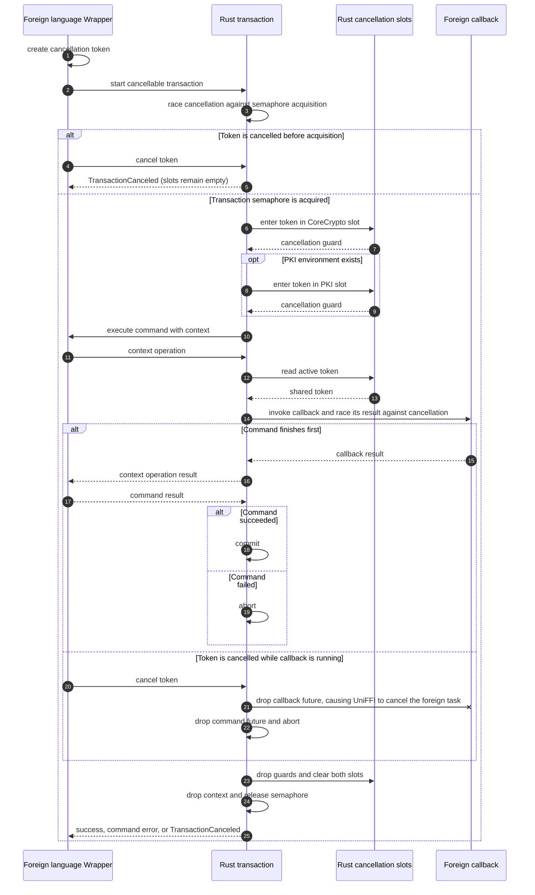

# Transactions and the TransactionContext

Every operation in CoreCrypto that can potentially mutate state must happen inside a transaction. Transactions provide
an atomicity guarantee: either all of the operations in a transaction are persisted together, or none of them are. This
prevents the keystore from being left in an inconsistent state if an operation fails partway through — for example, if a
commit is produced but the delivery service rejects it before the local group state is updated.

## Opening a Transaction

Transactions are opened with a callback pattern. Call `transaction()` on the `CoreCrypto` instance and pass an async
function; CoreCrypto calls that function with a `CoreCryptoContext` (the transaction handle), and commits or rolls back
the transaction automatically based on whether the function succeeds or throws:

<!-- langtabs-start -->

```typescript
await cc.transaction(async (ctx) => {
    await ctx.mlsInit(clientId, transport);
    // more operations...
});
```

```swift
try await cc.transaction { ctx in
    try await ctx.mlsInit(clientId: clientId, transport: transport)
    // more operations...
}
```

```kotlin
cc.transaction { ctx ->
    ctx.mlsInit(clientId, transport)
    // more operations...
}
```

<!-- langtabs-end -->

If the callback completes without throwing, the transaction is committed — all buffered operations are written to the
keystore in a single atomic database transaction. If the callback throws, the transaction is rolled back and no changes
are persisted.

There is no explicit `finish()` or `abort()` to call; both are handled automatically by `transaction()`.

## The CoreCryptoContext

The `ctx` parameter is the `CoreCryptoContext`: the object through which all mutating operations are performed. It is
only valid for the lifetime of the callback — using it after the callback returns will produce an
`InvalidTransactionContext` error.

All operations are **buffered in memory** inside the context. Nothing is written to the database until the callback
returns successfully. This means reads within the same transaction will observe the in-memory state, not the on-disk
state — if you create a conversation and immediately query it within the same transaction, the query will find it.

## Concurrency

Only one transaction may be active at a time. Calling `cc.transaction()` while another transaction is already running
will block until the first transaction finishes. This is a consequence of the single-writer constraint in the keystore;
see [the Database chapter](database.md#single-transaction-constraint) for more detail.

The practical implication is that large batches of work — for example, decrypting a backlog of incoming messages — will
block any concurrent attempt to encrypt and send a new message. During an initial sync, this is desirable, because there
are notable performance improvements to performing a large number of operations in a single transaction. On the other
hand, once a client is fully synced and active, the opposite advice applies: because they are blocking, it is advisable
to structure transactions to be as short-lived as possible.

## Error Handling

If an operation inside a transaction fails, it is usually best to let the error propagate out of the callback.
`transaction()` will catch it, roll back automatically, and rethrow — the caller can then handle the error without
worrying about cleanup:

<!-- langtabs-start -->

```typescript
try {
    await cc.transaction(async (ctx) => {
        await ctx.decryptMessage(conversationId, incomingCiphertext);
        await ctx.encryptMessage(conversationId, outgoingPlaintext);
    });
} catch (err) {
    // The transaction was rolled back. No state was changed.
}
```

```swift
do {
    try await cc.transaction { ctx in
        try await ctx.decryptMessage(conversationId: conversationId, payload: incomingCiphertext)
        try await ctx.encryptMessage(conversationId: conversationId, message: outgoingPlaintext)
    }
} catch {
    // The transaction was rolled back. No state was changed.
}
```

```kotlin
try {
    cc.transaction { ctx ->
        ctx.decryptMessage(conversationId, incomingCiphertext)
        ctx.encryptMessage(conversationId, outgoingPlaintext)
    }
} catch (e: Exception) {
    // The transaction was rolled back. No state was changed.
}
```

<!-- langtabs-end -->

### Retry After Delivery Failure

Some operations — those that produce a commit — invoke `MlsTransport.sendCommitBundle()` inside the transaction. If the
delivery service returns `Retry`, CoreCrypto propagates this as an `MlsError` and the transaction is rolled back. The
caller should fetch and process all pending incoming messages and then retry the operation in a new transaction.

### Reuse After Completion

Once `transaction()` returns (whether by success or failure), the `CoreCryptoContext` passed to the callback is
permanently invalidated. Any attempt to call methods on a finished context returns `InvalidTransactionContext`. Always
perform all work within the callback scope.

## Arbitrary Data Storage

The context provides two methods for storing a single blob of arbitrary bytes in the keystore, associated with the
device:

<!-- langtabs-start -->

```typescript
await ctx.setData(bytes)
const bytes = await ctx.getData()
```

```swift
try await ctx.setData(data: bytes)
let bytes = try await ctx.getData()
```

```kotlin
ctx.setData(bytes)
val bytes = ctx.getData()
```

<!-- langtabs-end -->

These were implemented for the purpose of checkpointing during initial sync / batch decryption, but are not limited to
that use.

## Transaction Cancellation (Swift)

The foreign-language wrappers can associate a `CoreCryptoCancellationToken` with a transaction, i.e., this is invisible
to users of the wrappers. However, currently **only the Swift wrapper** supports cancellable transactions. The
`CoreCryptoCancellationToken` is created through FFI but lives on the Rust side. Once the transaction owns the
transaction semaphore, Rust publishes the token in the `CoreCrypto` cancellation slot and, when a PKI environment
exists, in its separate slot. The returned guards keep the slots filled for exactly the lifetime of the transaction.

The following shows a transaction with a cancellable foreign callback, such as `MlsTransport.sendCommitBundle()` or a
`PkiEnvironment` hook. A transaction that does not invoke such a callback skips the callback portion of the sequence.



The guards are deliberately created after the transaction context. Rust drops local values in reverse declaration order,
so both slots are cleared before dropping the context that releases the semaphore. Consequently, the next transaction
cannot observe the previous transaction's token. If cancellation wins a callback race, dropping the Rust future also
causes UniFFI's generated foreign-language binding to cancel the task executing that callback.
