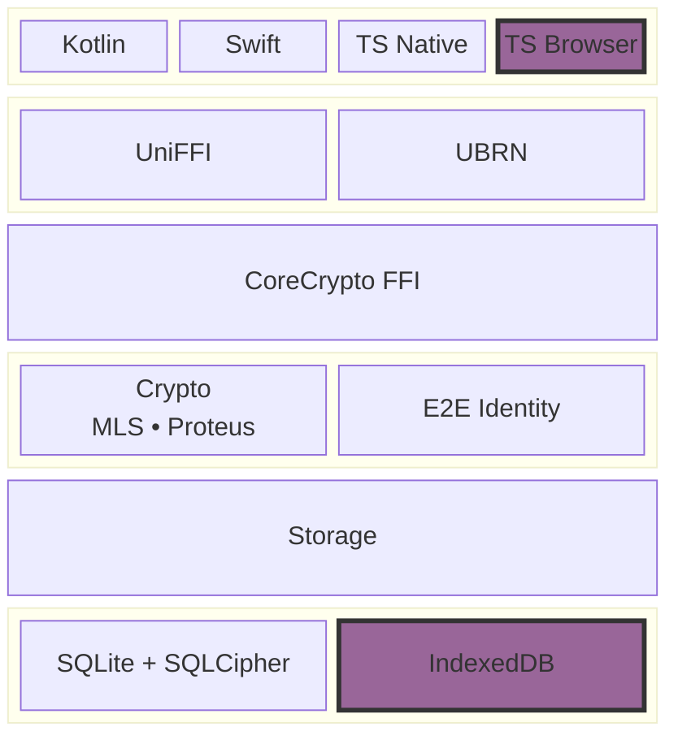

# CoreCrypto Architecture

## CoreCryptoFFI

Allows other programming languages and platforms to embed and interact with `CoreCrypto`

- For iOS and Android, [UniFFI](https://github.com/mozilla/uniffi-rs) is used to produce the relevant Kotlin and Swift
  bindings
- For Typescript we additionally use [UBRN](https://github.com/jhugman/uniffi-bindgen-react-native) to create a WASM
  binary for browser and a native binary for native TS from our UniFFI bindings.

## CoreCrypto

CoreCrypto provides a unified abstraction layer over MLS and Proteus. It exposes a simplified interface built around
application-level entities rather than protocol-specific concepts.

## Database

Encrypted Keystore powered by SQLCipher on native platforms. WASM uses an IndexedDB-backed, encrypted store with
AES256-GCM. The database's purpose is to securely store the Client's keying material on-device.
