# Wire end to end identity example

Ed25519 - SHA256

```mermaid
sequenceDiagram
    autonumber
    wire-client->>+acme-server: 🔒 GET /acme/wire/directory
    acme-server->>-wire-client: 200
    wire-client->>+acme-server: 🔒 HEAD /acme/wire/new-nonce
    acme-server->>-wire-client: 200
    wire-client->>+acme-server: 🔒 POST /acme/wire/new-account
    acme-server->>-wire-client: 201
    wire-client->>+acme-server: 🔒 POST /acme/wire/new-order
    acme-server->>-wire-client: 201
    wire-client->>+acme-server: 🔒 POST /acme/wire/authz/oJt5oJAsPPlkT2Xi6S0TqQGnVXc0yNMI
    acme-server->>-wire-client: 200
    wire-client->>+acme-server: 🔒 POST /acme/wire/authz/6tm9Es0xXXZgxyDo2cCeE34qE7zapMVd
    acme-server->>-wire-client: 200
    wire-client->>+wire-server:  GET /clients/9e4ef7e72ec9e5b9/nonce
    wire-server->>-wire-client: 200
    wire-client->>wire-client: create DPoP token
    wire-client->>+wire-server:  POST /clients/9e4ef7e72ec9e5b9/access-token
    wire-server->>-wire-client: 200
    wire-client->>+acme-server: 🔒 POST /acme/wire/challenge/oJt5oJAsPPlkT2Xi6S0TqQGnVXc0yNMI/RNPuq3ItJAva2y1ugBQ5YRUghLBsp7ex
    acme-server->>-wire-client: 200
    wire-client->>+acme-server: 🔒 POST /acme/wire/challenge/6tm9Es0xXXZgxyDo2cCeE34qE7zapMVd/YIYEFjs0LpfU6uYSNPROTI95zWJ0zLTb
    acme-server->>-wire-client: 200
    wire-client->>+acme-server: 🔒 POST /acme/wire/order/nuvADYZOyILWq7k8tbp0BNamCkZah3OK
    acme-server->>-wire-client: 200
    wire-client->>+acme-server: 🔒 POST /acme/wire/order/nuvADYZOyILWq7k8tbp0BNamCkZah3OK/finalize
    acme-server->>-wire-client: 200
    wire-client->>+acme-server: 🔒 POST /acme/wire/certificate/dmkTp1JcE7wqmYbZr2nDy5Z4hsgMonql
    acme-server->>-wire-client: 200
```



### Initial setup with ACME server

#### 1. fetch acme directory for hyperlinks

```http request
GET https://zylxi6.stepca:36197/acme/wire/directory
                               /acme/wire/directory
```

#### 2. get the ACME directory with links for newNonce, newAccount & newOrder

```http request
200
content-type: application/json
x-request-id: c9e48795-acf6-45d8-9a6b-787ab2185396
```

```json
{
  "newNonce": "https://zylxi6.stepca:36197/acme/wire/new-nonce",
  "newAccount": "https://zylxi6.stepca:36197/acme/wire/new-account",
  "newOrder": "https://zylxi6.stepca:36197/acme/wire/new-order",
  "revokeCert": "https://zylxi6.stepca:36197/acme/wire/revoke-cert"
}
```

#### 3. fetch a new nonce for the very first request

```http request
HEAD https://zylxi6.stepca:36197/acme/wire/new-nonce
                                /acme/{acme-provisioner}/new-nonce
```

#### 4. get a nonce for creating an account

```http request
200
cache-control: no-store
link: <https://zylxi6.stepca:36197/acme/wire/directory>;rel="index"
replay-nonce: SHRYbnJEMVRtZzJheHNTb1pzM2JQY1FCTzZqcnE4MlY
x-request-id: 00fdb734-c2c9-45d7-bc07-989be97cb131
```

```text
SHRYbnJEMVRtZzJheHNTb1pzM2JQY1FCTzZqcnE4MlY
```

#### 5. create a new account

```http request
POST https://zylxi6.stepca:36197/acme/wire/new-account
                                /acme/{acme-provisioner}/new-account
content-type: application/jose+json
```

```json
{
  "protected": "eyJhbGciOiJFZERTQSIsInR5cCI6IkpXVCIsImp3ayI6eyJrdHkiOiJPS1AiLCJjcnYiOiJFZDI1NTE5IiwieCI6IkktNnpDZ0RCc0RtM2F2THZ2cUpEOUNMV204SFJOUm9KZS1KRk9RQ0VwMlEifSwibm9uY2UiOiJTSFJZYm5KRU1WUnRaekpoZUhOVGIxcHpNMkpRWTFGQ1R6WnFjbkU0TWxZIiwidXJsIjoiaHR0cHM6Ly96eWx4aTYuc3RlcGNhOjM2MTk3L2FjbWUvd2lyZS9uZXctYWNjb3VudCJ9",
  "payload": "eyJ0ZXJtc09mU2VydmljZUFncmVlZCI6dHJ1ZSwiY29udGFjdCI6WyJhbm9ueW1vdXNAYW5vbnltb3VzLmludmFsaWQiXSwib25seVJldHVybkV4aXN0aW5nIjpmYWxzZX0",
  "signature": "mMCHCgNcDISTplaIkE8SOCdG9rGf0G1v-OWReFKvoOfStb558tGdlqxhFQlFKOAM0eOHj45b7sh-kCnQmrVJCA"
}
```

```json
{
  "payload": {
    "contact": [
      "anonymous@anonymous.invalid"
    ],
    "onlyReturnExisting": false,
    "termsOfServiceAgreed": true
  },
  "protected": {
    "alg": "EdDSA",
    "jwk": {
      "crv": "Ed25519",
      "kty": "OKP",
      "x": "I-6zCgDBsDm3avLvvqJD9CLWm8HRNRoJe-JFOQCEp2Q"
    },
    "nonce": "SHRYbnJEMVRtZzJheHNTb1pzM2JQY1FCTzZqcnE4MlY",
    "typ": "JWT",
    "url": "https://zylxi6.stepca:36197/acme/wire/new-account"
  }
}
```

#### 6. account created

```http request
201
cache-control: no-store
content-type: application/json
link: <https://zylxi6.stepca:36197/acme/wire/directory>;rel="index"
location: https://zylxi6.stepca:36197/acme/wire/account/x68dPXEQWDeTA3wm04N9zEwDS03vfHGG
replay-nonce: azN5MXVlQlRFN2VZY2dyMG5DS2NCRXhmZm1hOUwxZWE
x-request-id: c369e446-fefb-4688-9cf2-9ee7a72f068d
```

```json
{
  "status": "valid",
  "orders": "https://zylxi6.stepca:36197/acme/wire/account/x68dPXEQWDeTA3wm04N9zEwDS03vfHGG/orders"
}
```

### Request a certificate with relevant identifiers

#### 7. create a new order

```http request
POST https://zylxi6.stepca:36197/acme/wire/new-order
                                /acme/{acme-provisioner}/new-order
content-type: application/jose+json
```

```json
{
  "protected": "eyJhbGciOiJFZERTQSIsImtpZCI6Imh0dHBzOi8venlseGk2LnN0ZXBjYTozNjE5Ny9hY21lL3dpcmUvYWNjb3VudC94NjhkUFhFUVdEZVRBM3dtMDROOXpFd0RTMDN2ZkhHRyIsInR5cCI6IkpXVCIsIm5vbmNlIjoiYXpONU1YVmxRbFJGTjJWWlkyZHlNRzVEUzJOQ1JYaG1abTFoT1V3eFpXRSIsInVybCI6Imh0dHBzOi8venlseGk2LnN0ZXBjYTozNjE5Ny9hY21lL3dpcmUvbmV3LW9yZGVyIn0",
  "payload": "eyJpZGVudGlmaWVycyI6W3sidHlwZSI6IndpcmVhcHAtZGV2aWNlIiwidmFsdWUiOiJ7XCJjbGllbnQtaWRcIjpcIndpcmVhcHA6Ly9XcUVxYzlkSVJvS2gzVnlVSjhrNlFBITllNGVmN2U3MmVjOWU1YjlAd2lyZS5sb2NhbGhvc3RcIixcImhhbmRsZVwiOlwid2lyZWFwcDovLyU0MGFsaWNlX3dpcmVAd2lyZS5sb2NhbGhvc3RcIixcIm5hbWVcIjpcIkFsaWNlIFNtaXRoXCIsXCJkb21haW5cIjpcIndpcmUubG9jYWxob3N0XCJ9In0seyJ0eXBlIjoid2lyZWFwcC11c2VyIiwidmFsdWUiOiJ7XCJoYW5kbGVcIjpcIndpcmVhcHA6Ly8lNDBhbGljZV93aXJlQHdpcmUubG9jYWxob3N0XCIsXCJuYW1lXCI6XCJBbGljZSBTbWl0aFwiLFwiZG9tYWluXCI6XCJ3aXJlLmxvY2FsaG9zdFwifSJ9XSwibm90QmVmb3JlIjoiMjAyNi0wMS0xNVQwODo0MDo1NC4wMDkzOTQ3MTdaIiwibm90QWZ0ZXIiOiIyMDM2LTAxLTEzVDA4OjQwOjU0LjAwOTM5NDcxN1oifQ",
  "signature": "YedANEF1EhN92ZyMZ_JjYA0hSW0M4k-Y0QqouyAGhTkT8LYJePriWVgpDxH1klRrIFEpC4Lf-qbwcOjxf1vaBA"
}
```

```json
{
  "payload": {
    "identifiers": [
      {
        "type": "wireapp-device",
        "value": "{\"client-id\":\"wireapp://WqEqc9dIRoKh3VyUJ8k6QA!9e4ef7e72ec9e5b9@wire.localhost\",\"handle\":\"wireapp://%40alice_wire@wire.localhost\",\"name\":\"Alice Smith\",\"domain\":\"wire.localhost\"}"
      },
      {
        "type": "wireapp-user",
        "value": "{\"handle\":\"wireapp://%40alice_wire@wire.localhost\",\"name\":\"Alice Smith\",\"domain\":\"wire.localhost\"}"
      }
    ],
    "notAfter": "2036-01-13T08:40:54.009394717Z",
    "notBefore": "2026-01-15T08:40:54.009394717Z"
  },
  "protected": {
    "alg": "EdDSA",
    "kid": "https://zylxi6.stepca:36197/acme/wire/account/x68dPXEQWDeTA3wm04N9zEwDS03vfHGG",
    "nonce": "azN5MXVlQlRFN2VZY2dyMG5DS2NCRXhmZm1hOUwxZWE",
    "typ": "JWT",
    "url": "https://zylxi6.stepca:36197/acme/wire/new-order"
  }
}
```

#### 8. get new order with authorization URLS and finalize URL

```http request
201
cache-control: no-store
content-type: application/json
link: <https://zylxi6.stepca:36197/acme/wire/directory>;rel="index"
location: https://zylxi6.stepca:36197/acme/wire/order/nuvADYZOyILWq7k8tbp0BNamCkZah3OK
replay-nonce: RzhsT0gwZDRlWHpybU5KcGZGd3MycngzM1dja3pVdG8
x-request-id: fcffca8e-19e7-453e-adfd-7fe1537b96b4
```

```json
{
  "status": "pending",
  "finalize": "https://zylxi6.stepca:36197/acme/wire/order/nuvADYZOyILWq7k8tbp0BNamCkZah3OK/finalize",
  "identifiers": [
    {
      "type": "wireapp-device",
      "value": "{\"client-id\":\"wireapp://WqEqc9dIRoKh3VyUJ8k6QA!9e4ef7e72ec9e5b9@wire.localhost\",\"handle\":\"wireapp://%40alice_wire@wire.localhost\",\"name\":\"Alice Smith\",\"domain\":\"wire.localhost\"}"
    },
    {
      "type": "wireapp-user",
      "value": "{\"handle\":\"wireapp://%40alice_wire@wire.localhost\",\"name\":\"Alice Smith\",\"domain\":\"wire.localhost\"}"
    }
  ],
  "authorizations": [
    "https://zylxi6.stepca:36197/acme/wire/authz/oJt5oJAsPPlkT2Xi6S0TqQGnVXc0yNMI",
    "https://zylxi6.stepca:36197/acme/wire/authz/6tm9Es0xXXZgxyDo2cCeE34qE7zapMVd"
  ],
  "expires": "2026-01-16T08:40:54Z",
  "notBefore": "2026-01-15T08:40:54.009394717Z",
  "notAfter": "2036-01-13T08:40:54.009394717Z"
}
```

### Display-name and handle already authorized

#### 9. create authorization and fetch challenges

```http request
POST https://zylxi6.stepca:36197/acme/wire/authz/oJt5oJAsPPlkT2Xi6S0TqQGnVXc0yNMI
                                /acme/{acme-provisioner}/authz/{authz-id}
content-type: application/jose+json
```

```json
{
  "protected": "eyJhbGciOiJFZERTQSIsImtpZCI6Imh0dHBzOi8venlseGk2LnN0ZXBjYTozNjE5Ny9hY21lL3dpcmUvYWNjb3VudC94NjhkUFhFUVdEZVRBM3dtMDROOXpFd0RTMDN2ZkhHRyIsInR5cCI6IkpXVCIsIm5vbmNlIjoiUnpoc1QwZ3daRFJsV0hweWJVNUtjR1pHZDNNeWNuZ3pNMWRqYTNwVmRHOCIsInVybCI6Imh0dHBzOi8venlseGk2LnN0ZXBjYTozNjE5Ny9hY21lL3dpcmUvYXV0aHovb0p0NW9KQXNQUGxrVDJYaTZTMFRxUUduVlhjMHlOTUkifQ",
  "payload": "",
  "signature": "iwzWiQ3R_SARYaM_a3slYigs-up2AR7p3SZxHqN9R0KET9ff7oec5LZEBh7RoqLhIxF9s2k51_0_koHppADYCw"
}
```

```json
{
  "payload": {},
  "protected": {
    "alg": "EdDSA",
    "kid": "https://zylxi6.stepca:36197/acme/wire/account/x68dPXEQWDeTA3wm04N9zEwDS03vfHGG",
    "nonce": "RzhsT0gwZDRlWHpybU5KcGZGd3MycngzM1dja3pVdG8",
    "typ": "JWT",
    "url": "https://zylxi6.stepca:36197/acme/wire/authz/oJt5oJAsPPlkT2Xi6S0TqQGnVXc0yNMI"
  }
}
```

#### 10. get back challenges

```http request
200
cache-control: no-store
content-type: application/json
link: <https://zylxi6.stepca:36197/acme/wire/directory>;rel="index"
location: https://zylxi6.stepca:36197/acme/wire/authz/oJt5oJAsPPlkT2Xi6S0TqQGnVXc0yNMI
replay-nonce: dUZNTzRwOFY1TzF2RnRBR28wdXNEZDVXU2I2YWNuRlc
x-request-id: 0185adba-aeba-44d6-9593-ff633e793d7e
```

```json
{
  "status": "pending",
  "expires": "2026-01-16T08:40:54Z",
  "challenges": [
    {
      "type": "wire-dpop-01",
      "url": "https://zylxi6.stepca:36197/acme/wire/challenge/oJt5oJAsPPlkT2Xi6S0TqQGnVXc0yNMI/RNPuq3ItJAva2y1ugBQ5YRUghLBsp7ex",
      "status": "pending",
      "token": "Eo2Mdrb6PiUVEUO9Va2VekSfnEmChQIz",
      "target": "http://wire.localhost:40539/clients/9e4ef7e72ec9e5b9/access-token"
    }
  ],
  "identifier": {
    "type": "wireapp-device",
    "value": "{\"client-id\":\"wireapp://WqEqc9dIRoKh3VyUJ8k6QA!9e4ef7e72ec9e5b9@wire.localhost\",\"handle\":\"wireapp://%40alice_wire@wire.localhost\",\"name\":\"Alice Smith\",\"domain\":\"wire.localhost\"}"
  }
}
```

```http request
POST https://zylxi6.stepca:36197/acme/wire/authz/6tm9Es0xXXZgxyDo2cCeE34qE7zapMVd
                                /acme/{acme-provisioner}/authz/{authz-id}
content-type: application/jose+json
```

```json
{
  "protected": "eyJhbGciOiJFZERTQSIsImtpZCI6Imh0dHBzOi8venlseGk2LnN0ZXBjYTozNjE5Ny9hY21lL3dpcmUvYWNjb3VudC94NjhkUFhFUVdEZVRBM3dtMDROOXpFd0RTMDN2ZkhHRyIsInR5cCI6IkpXVCIsIm5vbmNlIjoiZFVaTlR6UndPRlkxVHpGMlJuUkJSMjh3ZFhORVpEVlhVMkkyWVdOdVJsYyIsInVybCI6Imh0dHBzOi8venlseGk2LnN0ZXBjYTozNjE5Ny9hY21lL3dpcmUvYXV0aHovNnRtOUVzMHhYWFpneHlEbzJjQ2VFMzRxRTd6YXBNVmQifQ",
  "payload": "",
  "signature": "QPyqTUbksn5t0ubnLPcsrVEovKBlYjm0sc8uR-H_6IaBZpozSDpagck-fEX5Ff2ZzbvESpuBEuKqdE1g59EsBg"
}
```

```json
{
  "payload": {},
  "protected": {
    "alg": "EdDSA",
    "kid": "https://zylxi6.stepca:36197/acme/wire/account/x68dPXEQWDeTA3wm04N9zEwDS03vfHGG",
    "nonce": "dUZNTzRwOFY1TzF2RnRBR28wdXNEZDVXU2I2YWNuRlc",
    "typ": "JWT",
    "url": "https://zylxi6.stepca:36197/acme/wire/authz/6tm9Es0xXXZgxyDo2cCeE34qE7zapMVd"
  }
}
```

#### 11. get back challenges

```http request
200
cache-control: no-store
content-type: application/json
link: <https://zylxi6.stepca:36197/acme/wire/directory>;rel="index"
location: https://zylxi6.stepca:36197/acme/wire/authz/6tm9Es0xXXZgxyDo2cCeE34qE7zapMVd
replay-nonce: NjQ3azBiQ2tYUjE0Q2xWWEFVOG1RbmxrZTdiUXRySW4
x-request-id: bcef1a1b-6f25-4021-8fa2-f3c001b3a8f6
```

```json
{
  "status": "pending",
  "expires": "2026-01-16T08:40:54Z",
  "challenges": [
    {
      "type": "wire-oidc-01",
      "url": "https://zylxi6.stepca:36197/acme/wire/challenge/6tm9Es0xXXZgxyDo2cCeE34qE7zapMVd/YIYEFjs0LpfU6uYSNPROTI95zWJ0zLTb",
      "status": "pending",
      "token": "AoDXqw4NHU5vgnEQBBjuBDvGSPqcv47b",
      "target": "http://authelia.local:40255/"
    }
  ],
  "identifier": {
    "type": "wireapp-user",
    "value": "{\"handle\":\"wireapp://%40alice_wire@wire.localhost\",\"name\":\"Alice Smith\",\"domain\":\"wire.localhost\"}"
  }
}
```

### Client fetches JWT DPoP access token (with wire-server)

#### 12. fetch a nonce from wire-server

```http request
GET http://wire.localhost:40539/clients/9e4ef7e72ec9e5b9/nonce
```

#### 13. get wire-server nonce

```http request
200

```

```text
xLrz9ZBKRem4U0fMVbtNcQ
```

#### 14. create client DPoP token

<details>
<summary><b>Dpop token</b></summary>

See it on
[jwt.io](https://jwt.io/#id_token=eyJhbGciOiJFZERTQSIsInR5cCI6ImRwb3Arand0IiwiandrIjp7Imt0eSI6Ik9LUCIsImNydiI6IkVkMjU1MTkiLCJ4IjoiSS02ekNnREJzRG0zYXZMdnZxSkQ5Q0xXbThIUk5Sb0plLUpGT1FDRXAyUSJ9fQ.eyJpYXQiOjE3Njg0NjI4NTQsImV4cCI6MTc2ODQ3MDA1NCwibmJmIjoxNzY4NDYyODU0LCJzdWIiOiJ3aXJlYXBwOi8vV3FFcWM5ZElSb0toM1Z5VUo4azZRQSE5ZTRlZjdlNzJlYzllNWI5QHdpcmUubG9jYWxob3N0IiwiYXVkIjoiaHR0cHM6Ly96eWx4aTYuc3RlcGNhOjM2MTk3L2FjbWUvd2lyZS9jaGFsbGVuZ2Uvb0p0NW9KQXNQUGxrVDJYaTZTMFRxUUduVlhjMHlOTUkvUk5QdXEzSXRKQXZhMnkxdWdCUTVZUlVnaExCc3A3ZXgiLCJqdGkiOiJjZWM1YzAyZC1mOWVhLTQ3MjUtYmQyOC1hYzhlYmI2NTYyZTgiLCJub25jZSI6InhMcno5WkJLUmVtNFUwZk1WYnROY1EiLCJodG0iOiJQT1NUIiwiaHR1IjoiaHR0cDovL3dpcmUubG9jYWxob3N0OjQwNTM5L2NsaWVudHMvOWU0ZWY3ZTcyZWM5ZTViOS9hY2Nlc3MtdG9rZW4iLCJjaGFsIjoiRW8yTWRyYjZQaVVWRVVPOVZhMlZla1NmbkVtQ2hRSXoiLCJoYW5kbGUiOiJ3aXJlYXBwOi8vJTQwYWxpY2Vfd2lyZUB3aXJlLmxvY2FsaG9zdCIsInRlYW0iOiJ3aXJlIiwibmFtZSI6IkFsaWNlIFNtaXRoIn0.QcF3S3NHqcZ1YItSam7rp2qyhKkMC16bESnMAhPkEY6CGxSAycca5HXQZeuoO7OArknGLoyootPb10iVAN0_Bg)

Raw:

```text
eyJhbGciOiJFZERTQSIsInR5cCI6ImRwb3Arand0IiwiandrIjp7Imt0eSI6Ik9L
UCIsImNydiI6IkVkMjU1MTkiLCJ4IjoiSS02ekNnREJzRG0zYXZMdnZxSkQ5Q0xX
bThIUk5Sb0plLUpGT1FDRXAyUSJ9fQ.eyJpYXQiOjE3Njg0NjI4NTQsImV4cCI6M
Tc2ODQ3MDA1NCwibmJmIjoxNzY4NDYyODU0LCJzdWIiOiJ3aXJlYXBwOi8vV3FFc
WM5ZElSb0toM1Z5VUo4azZRQSE5ZTRlZjdlNzJlYzllNWI5QHdpcmUubG9jYWxob
3N0IiwiYXVkIjoiaHR0cHM6Ly96eWx4aTYuc3RlcGNhOjM2MTk3L2FjbWUvd2lyZ
S9jaGFsbGVuZ2Uvb0p0NW9KQXNQUGxrVDJYaTZTMFRxUUduVlhjMHlOTUkvUk5Qd
XEzSXRKQXZhMnkxdWdCUTVZUlVnaExCc3A3ZXgiLCJqdGkiOiJjZWM1YzAyZC1mO
WVhLTQ3MjUtYmQyOC1hYzhlYmI2NTYyZTgiLCJub25jZSI6InhMcno5WkJLUmVtN
FUwZk1WYnROY1EiLCJodG0iOiJQT1NUIiwiaHR1IjoiaHR0cDovL3dpcmUubG9jY
Wxob3N0OjQwNTM5L2NsaWVudHMvOWU0ZWY3ZTcyZWM5ZTViOS9hY2Nlc3MtdG9rZ
W4iLCJjaGFsIjoiRW8yTWRyYjZQaVVWRVVPOVZhMlZla1NmbkVtQ2hRSXoiLCJoY
W5kbGUiOiJ3aXJlYXBwOi8vJTQwYWxpY2Vfd2lyZUB3aXJlLmxvY2FsaG9zdCIsI
nRlYW0iOiJ3aXJlIiwibmFtZSI6IkFsaWNlIFNtaXRoIn0.QcF3S3NHqcZ1YItSa
m7rp2qyhKkMC16bESnMAhPkEY6CGxSAycca5HXQZeuoO7OArknGLoyootPb10iVA
N0_Bg
```

Decoded:

```json
{
  "alg": "EdDSA",
  "jwk": {
    "crv": "Ed25519",
    "kty": "OKP",
    "x": "I-6zCgDBsDm3avLvvqJD9CLWm8HRNRoJe-JFOQCEp2Q"
  },
  "typ": "dpop+jwt"
}
```

```json
{
  "aud": "https://zylxi6.stepca:36197/acme/wire/challenge/oJt5oJAsPPlkT2Xi6S0TqQGnVXc0yNMI/RNPuq3ItJAva2y1ugBQ5YRUghLBsp7ex",
  "chal": "Eo2Mdrb6PiUVEUO9Va2VekSfnEmChQIz",
  "exp": 1768470054,
  "handle": "wireapp://%40alice_wire@wire.localhost",
  "htm": "POST",
  "htu": "http://wire.localhost:40539/clients/9e4ef7e72ec9e5b9/access-token",
  "iat": 1768462854,
  "jti": "cec5c02d-f9ea-4725-bd28-ac8ebb6562e8",
  "name": "Alice Smith",
  "nbf": 1768462854,
  "nonce": "xLrz9ZBKRem4U0fMVbtNcQ",
  "sub": "wireapp://WqEqc9dIRoKh3VyUJ8k6QA!9e4ef7e72ec9e5b9@wire.localhost",
  "team": "wire"
}
```

✅ Signature Verified with key:

```text
-----BEGIN PUBLIC KEY-----
MCowBQYDK2VwAyEAI+6zCgDBsDm3avLvvqJD9CLWm8HRNRoJe+JFOQCEp2Q=
-----END PUBLIC KEY-----
```

</details>

#### 15. trade client DPoP token for an access token

```http request
POST http://wire.localhost:40539/clients/9e4ef7e72ec9e5b9/access-token
                                /clients/{device-id}/access-token
dpop: ZXlKaGJHY2lPaUpGWkVSVFFTSXNJblI1Y0NJNkltUndiM0FyYW5kMElpd2lhbmRySWpwN0ltdDBlU0k2SWs5TFVDSXNJbU55ZGlJNklrVmtNalUxTVRraUxDSjRJam9pU1MwMmVrTm5SRUp6UkcwellYWk1kblp4U2tRNVEweFhiVGhJVWs1U2IwcGxMVXBHVDFGRFJYQXlVU0o5ZlEuZXlKcFlYUWlPakUzTmpnME5qSTROVFFzSW1WNGNDSTZNVGMyT0RRM01EQTFOQ3dpYm1KbUlqb3hOelk0TkRZeU9EVTBMQ0p6ZFdJaU9pSjNhWEpsWVhCd09pOHZWM0ZGY1dNNVpFbFNiMHRvTTFaNVZVbzRhelpSUVNFNVpUUmxaamRsTnpKbFl6bGxOV0k1UUhkcGNtVXViRzlqWVd4b2IzTjBJaXdpWVhWa0lqb2lhSFIwY0hNNkx5OTZlV3g0YVRZdWMzUmxjR05oT2pNMk1UazNMMkZqYldVdmQybHlaUzlqYUdGc2JHVnVaMlV2YjBwME5XOUtRWE5RVUd4clZESllhVFpUTUZSeFVVZHVWbGhqTUhsT1RVa3ZVazVRZFhFelNYUktRWFpoTW5reGRXZENVVFZaVWxWbmFFeENjM0EzWlhnaUxDSnFkR2tpT2lKalpXTTFZekF5WkMxbU9XVmhMVFEzTWpVdFltUXlPQzFoWXpobFltSTJOVFl5WlRnaUxDSnViMjVqWlNJNkluaE1jbm81V2tKTFVtVnRORlV3WmsxV1luUk9ZMUVpTENKb2RHMGlPaUpRVDFOVUlpd2lhSFIxSWpvaWFIUjBjRG92TDNkcGNtVXViRzlqWVd4b2IzTjBPalF3TlRNNUwyTnNhV1Z1ZEhNdk9XVTBaV1kzWlRjeVpXTTVaVFZpT1M5aFkyTmxjM010ZEc5clpXNGlMQ0pqYUdGc0lqb2lSVzh5VFdSeVlqWlFhVlZXUlZWUE9WWmhNbFpsYTFObWJrVnRRMmhSU1hvaUxDSm9ZVzVrYkdVaU9pSjNhWEpsWVhCd09pOHZKVFF3WVd4cFkyVmZkMmx5WlVCM2FYSmxMbXh2WTJGc2FHOXpkQ0lzSW5SbFlXMGlPaUozYVhKbElpd2libUZ0WlNJNklrRnNhV05sSUZOdGFYUm9JbjAuUWNGM1MzTkhxY1oxWUl0U2FtN3JwMnF5aEtrTUMxNmJFU25NQWhQa0VZNkNHeFNBeWNjYTVIWFFaZXVvTzdPQXJrbkdMb3lvb3RQYjEwaVZBTjBfQmc
```

#### 16. get a Dpop access token from wire-server

```http request
200

```

```json
{
  "expires_in": 2082008461,
  "token": "eyJhbGciOiJFZERTQSIsInR5cCI6ImF0K2p3dCIsImp3ayI6eyJrdHkiOiJPS1AiLCJjcnYiOiJFZDI1NTE5IiwieCI6IkVXWnhDRTRUZjc5S09iR0FVWTdzd1ZkLWFVOGlSSXNlaEY2ejd3cjBKNnMifX0.eyJpYXQiOjE3Njg0NjI4NTQsImV4cCI6MTc2ODQ2NjgxNCwibmJmIjoxNzY4NDYyODU0LCJpc3MiOiJodHRwOi8vd2lyZS5sb2NhbGhvc3Q6NDA1MzkvY2xpZW50cy85ZTRlZjdlNzJlYzllNWI5L2FjY2Vzcy10b2tlbiIsInN1YiI6IndpcmVhcHA6Ly9XcUVxYzlkSVJvS2gzVnlVSjhrNlFBITllNGVmN2U3MmVjOWU1YjlAd2lyZS5sb2NhbGhvc3QiLCJhdWQiOiJodHRwczovL3p5bHhpNi5zdGVwY2E6MzYxOTcvYWNtZS93aXJlL2NoYWxsZW5nZS9vSnQ1b0pBc1BQbGtUMlhpNlMwVHFRR25WWGMweU5NSS9STlB1cTNJdEpBdmEyeTF1Z0JRNVlSVWdoTEJzcDdleCIsImp0aSI6ImViMWViNTM0LTk4MDMtNDhmMS1hNTRiLWE4MGQ5MTEyMDViMSIsIm5vbmNlIjoieExyejlaQktSZW00VTBmTVZidE5jUSIsImNoYWwiOiJFbzJNZHJiNlBpVVZFVU85VmEyVmVrU2ZuRW1DaFFJeiIsImNuZiI6eyJraWQiOiJUelVLMUhKbGtORzNKWU96dzhSSXRJWFEzTXQxcDZIMU9ZUWJPamktQS1nIn0sInByb29mIjoiZXlKaGJHY2lPaUpGWkVSVFFTSXNJblI1Y0NJNkltUndiM0FyYW5kMElpd2lhbmRySWpwN0ltdDBlU0k2SWs5TFVDSXNJbU55ZGlJNklrVmtNalUxTVRraUxDSjRJam9pU1MwMmVrTm5SRUp6UkcwellYWk1kblp4U2tRNVEweFhiVGhJVWs1U2IwcGxMVXBHVDFGRFJYQXlVU0o5ZlEuZXlKcFlYUWlPakUzTmpnME5qSTROVFFzSW1WNGNDSTZNVGMyT0RRM01EQTFOQ3dpYm1KbUlqb3hOelk0TkRZeU9EVTBMQ0p6ZFdJaU9pSjNhWEpsWVhCd09pOHZWM0ZGY1dNNVpFbFNiMHRvTTFaNVZVbzRhelpSUVNFNVpUUmxaamRsTnpKbFl6bGxOV0k1UUhkcGNtVXViRzlqWVd4b2IzTjBJaXdpWVhWa0lqb2lhSFIwY0hNNkx5OTZlV3g0YVRZdWMzUmxjR05oT2pNMk1UazNMMkZqYldVdmQybHlaUzlqYUdGc2JHVnVaMlV2YjBwME5XOUtRWE5RVUd4clZESllhVFpUTUZSeFVVZHVWbGhqTUhsT1RVa3ZVazVRZFhFelNYUktRWFpoTW5reGRXZENVVFZaVWxWbmFFeENjM0EzWlhnaUxDSnFkR2tpT2lKalpXTTFZekF5WkMxbU9XVmhMVFEzTWpVdFltUXlPQzFoWXpobFltSTJOVFl5WlRnaUxDSnViMjVqWlNJNkluaE1jbm81V2tKTFVtVnRORlV3WmsxV1luUk9ZMUVpTENKb2RHMGlPaUpRVDFOVUlpd2lhSFIxSWpvaWFIUjBjRG92TDNkcGNtVXViRzlqWVd4b2IzTjBPalF3TlRNNUwyTnNhV1Z1ZEhNdk9XVTBaV1kzWlRjeVpXTTVaVFZpT1M5aFkyTmxjM010ZEc5clpXNGlMQ0pqYUdGc0lqb2lSVzh5VFdSeVlqWlFhVlZXUlZWUE9WWmhNbFpsYTFObWJrVnRRMmhSU1hvaUxDSm9ZVzVrYkdVaU9pSjNhWEpsWVhCd09pOHZKVFF3WVd4cFkyVmZkMmx5WlVCM2FYSmxMbXh2WTJGc2FHOXpkQ0lzSW5SbFlXMGlPaUozYVhKbElpd2libUZ0WlNJNklrRnNhV05sSUZOdGFYUm9JbjAuUWNGM1MzTkhxY1oxWUl0U2FtN3JwMnF5aEtrTUMxNmJFU25NQWhQa0VZNkNHeFNBeWNjYTVIWFFaZXVvTzdPQXJrbkdMb3lvb3RQYjEwaVZBTjBfQmciLCJjbGllbnRfaWQiOiJ3aXJlYXBwOi8vV3FFcWM5ZElSb0toM1Z5VUo4azZRQSE5ZTRlZjdlNzJlYzllNWI5QHdpcmUubG9jYWxob3N0IiwiYXBpX3ZlcnNpb24iOjUsInNjb3BlIjoid2lyZV9jbGllbnRfaWQifQ.MPZPaLUra0BvgOPezeAS9hIi82IWV2BteJb4OLxwog5KKT4TecQfrqnP7MjHleLAfdCxbytc56LJv9BRMXh5Dw",
  "type": "DPoP"
}
```

<details>
<summary><b>Access token</b></summary>

See it on
[jwt.io](https://jwt.io/#id_token=eyJhbGciOiJFZERTQSIsInR5cCI6ImF0K2p3dCIsImp3ayI6eyJrdHkiOiJPS1AiLCJjcnYiOiJFZDI1NTE5IiwieCI6IkVXWnhDRTRUZjc5S09iR0FVWTdzd1ZkLWFVOGlSSXNlaEY2ejd3cjBKNnMifX0.eyJpYXQiOjE3Njg0NjI4NTQsImV4cCI6MTc2ODQ2NjgxNCwibmJmIjoxNzY4NDYyODU0LCJpc3MiOiJodHRwOi8vd2lyZS5sb2NhbGhvc3Q6NDA1MzkvY2xpZW50cy85ZTRlZjdlNzJlYzllNWI5L2FjY2Vzcy10b2tlbiIsInN1YiI6IndpcmVhcHA6Ly9XcUVxYzlkSVJvS2gzVnlVSjhrNlFBITllNGVmN2U3MmVjOWU1YjlAd2lyZS5sb2NhbGhvc3QiLCJhdWQiOiJodHRwczovL3p5bHhpNi5zdGVwY2E6MzYxOTcvYWNtZS93aXJlL2NoYWxsZW5nZS9vSnQ1b0pBc1BQbGtUMlhpNlMwVHFRR25WWGMweU5NSS9STlB1cTNJdEpBdmEyeTF1Z0JRNVlSVWdoTEJzcDdleCIsImp0aSI6ImViMWViNTM0LTk4MDMtNDhmMS1hNTRiLWE4MGQ5MTEyMDViMSIsIm5vbmNlIjoieExyejlaQktSZW00VTBmTVZidE5jUSIsImNoYWwiOiJFbzJNZHJiNlBpVVZFVU85VmEyVmVrU2ZuRW1DaFFJeiIsImNuZiI6eyJraWQiOiJUelVLMUhKbGtORzNKWU96dzhSSXRJWFEzTXQxcDZIMU9ZUWJPamktQS1nIn0sInByb29mIjoiZXlKaGJHY2lPaUpGWkVSVFFTSXNJblI1Y0NJNkltUndiM0FyYW5kMElpd2lhbmRySWpwN0ltdDBlU0k2SWs5TFVDSXNJbU55ZGlJNklrVmtNalUxTVRraUxDSjRJam9pU1MwMmVrTm5SRUp6UkcwellYWk1kblp4U2tRNVEweFhiVGhJVWs1U2IwcGxMVXBHVDFGRFJYQXlVU0o5ZlEuZXlKcFlYUWlPakUzTmpnME5qSTROVFFzSW1WNGNDSTZNVGMyT0RRM01EQTFOQ3dpYm1KbUlqb3hOelk0TkRZeU9EVTBMQ0p6ZFdJaU9pSjNhWEpsWVhCd09pOHZWM0ZGY1dNNVpFbFNiMHRvTTFaNVZVbzRhelpSUVNFNVpUUmxaamRsTnpKbFl6bGxOV0k1UUhkcGNtVXViRzlqWVd4b2IzTjBJaXdpWVhWa0lqb2lhSFIwY0hNNkx5OTZlV3g0YVRZdWMzUmxjR05oT2pNMk1UazNMMkZqYldVdmQybHlaUzlqYUdGc2JHVnVaMlV2YjBwME5XOUtRWE5RVUd4clZESllhVFpUTUZSeFVVZHVWbGhqTUhsT1RVa3ZVazVRZFhFelNYUktRWFpoTW5reGRXZENVVFZaVWxWbmFFeENjM0EzWlhnaUxDSnFkR2tpT2lKalpXTTFZekF5WkMxbU9XVmhMVFEzTWpVdFltUXlPQzFoWXpobFltSTJOVFl5WlRnaUxDSnViMjVqWlNJNkluaE1jbm81V2tKTFVtVnRORlV3WmsxV1luUk9ZMUVpTENKb2RHMGlPaUpRVDFOVUlpd2lhSFIxSWpvaWFIUjBjRG92TDNkcGNtVXViRzlqWVd4b2IzTjBPalF3TlRNNUwyTnNhV1Z1ZEhNdk9XVTBaV1kzWlRjeVpXTTVaVFZpT1M5aFkyTmxjM010ZEc5clpXNGlMQ0pqYUdGc0lqb2lSVzh5VFdSeVlqWlFhVlZXUlZWUE9WWmhNbFpsYTFObWJrVnRRMmhSU1hvaUxDSm9ZVzVrYkdVaU9pSjNhWEpsWVhCd09pOHZKVFF3WVd4cFkyVmZkMmx5WlVCM2FYSmxMbXh2WTJGc2FHOXpkQ0lzSW5SbFlXMGlPaUozYVhKbElpd2libUZ0WlNJNklrRnNhV05sSUZOdGFYUm9JbjAuUWNGM1MzTkhxY1oxWUl0U2FtN3JwMnF5aEtrTUMxNmJFU25NQWhQa0VZNkNHeFNBeWNjYTVIWFFaZXVvTzdPQXJrbkdMb3lvb3RQYjEwaVZBTjBfQmciLCJjbGllbnRfaWQiOiJ3aXJlYXBwOi8vV3FFcWM5ZElSb0toM1Z5VUo4azZRQSE5ZTRlZjdlNzJlYzllNWI5QHdpcmUubG9jYWxob3N0IiwiYXBpX3ZlcnNpb24iOjUsInNjb3BlIjoid2lyZV9jbGllbnRfaWQifQ.MPZPaLUra0BvgOPezeAS9hIi82IWV2BteJb4OLxwog5KKT4TecQfrqnP7MjHleLAfdCxbytc56LJv9BRMXh5Dw)

Raw:

```text
eyJhbGciOiJFZERTQSIsInR5cCI6ImF0K2p3dCIsImp3ayI6eyJrdHkiOiJPS1Ai
LCJjcnYiOiJFZDI1NTE5IiwieCI6IkVXWnhDRTRUZjc5S09iR0FVWTdzd1ZkLWFV
OGlSSXNlaEY2ejd3cjBKNnMifX0.eyJpYXQiOjE3Njg0NjI4NTQsImV4cCI6MTc2
ODQ2NjgxNCwibmJmIjoxNzY4NDYyODU0LCJpc3MiOiJodHRwOi8vd2lyZS5sb2Nh
bGhvc3Q6NDA1MzkvY2xpZW50cy85ZTRlZjdlNzJlYzllNWI5L2FjY2Vzcy10b2tl
biIsInN1YiI6IndpcmVhcHA6Ly9XcUVxYzlkSVJvS2gzVnlVSjhrNlFBITllNGVm
N2U3MmVjOWU1YjlAd2lyZS5sb2NhbGhvc3QiLCJhdWQiOiJodHRwczovL3p5bHhp
Ni5zdGVwY2E6MzYxOTcvYWNtZS93aXJlL2NoYWxsZW5nZS9vSnQ1b0pBc1BQbGtU
MlhpNlMwVHFRR25WWGMweU5NSS9STlB1cTNJdEpBdmEyeTF1Z0JRNVlSVWdoTEJz
cDdleCIsImp0aSI6ImViMWViNTM0LTk4MDMtNDhmMS1hNTRiLWE4MGQ5MTEyMDVi
MSIsIm5vbmNlIjoieExyejlaQktSZW00VTBmTVZidE5jUSIsImNoYWwiOiJFbzJN
ZHJiNlBpVVZFVU85VmEyVmVrU2ZuRW1DaFFJeiIsImNuZiI6eyJraWQiOiJUelVL
MUhKbGtORzNKWU96dzhSSXRJWFEzTXQxcDZIMU9ZUWJPamktQS1nIn0sInByb29m
IjoiZXlKaGJHY2lPaUpGWkVSVFFTSXNJblI1Y0NJNkltUndiM0FyYW5kMElpd2lh
bmRySWpwN0ltdDBlU0k2SWs5TFVDSXNJbU55ZGlJNklrVmtNalUxTVRraUxDSjRJ
am9pU1MwMmVrTm5SRUp6UkcwellYWk1kblp4U2tRNVEweFhiVGhJVWs1U2IwcGxM
VXBHVDFGRFJYQXlVU0o5ZlEuZXlKcFlYUWlPakUzTmpnME5qSTROVFFzSW1WNGND
STZNVGMyT0RRM01EQTFOQ3dpYm1KbUlqb3hOelk0TkRZeU9EVTBMQ0p6ZFdJaU9p
SjNhWEpsWVhCd09pOHZWM0ZGY1dNNVpFbFNiMHRvTTFaNVZVbzRhelpSUVNFNVpU
UmxaamRsTnpKbFl6bGxOV0k1UUhkcGNtVXViRzlqWVd4b2IzTjBJaXdpWVhWa0lq
b2lhSFIwY0hNNkx5OTZlV3g0YVRZdWMzUmxjR05oT2pNMk1UazNMMkZqYldVdmQy
bHlaUzlqYUdGc2JHVnVaMlV2YjBwME5XOUtRWE5RVUd4clZESllhVFpUTUZSeFVV
ZHVWbGhqTUhsT1RVa3ZVazVRZFhFelNYUktRWFpoTW5reGRXZENVVFZaVWxWbmFF
eENjM0EzWlhnaUxDSnFkR2tpT2lKalpXTTFZekF5WkMxbU9XVmhMVFEzTWpVdFlt
UXlPQzFoWXpobFltSTJOVFl5WlRnaUxDSnViMjVqWlNJNkluaE1jbm81V2tKTFVt
VnRORlV3WmsxV1luUk9ZMUVpTENKb2RHMGlPaUpRVDFOVUlpd2lhSFIxSWpvaWFI
UjBjRG92TDNkcGNtVXViRzlqWVd4b2IzTjBPalF3TlRNNUwyTnNhV1Z1ZEhNdk9X
VTBaV1kzWlRjeVpXTTVaVFZpT1M5aFkyTmxjM010ZEc5clpXNGlMQ0pqYUdGc0lq
b2lSVzh5VFdSeVlqWlFhVlZXUlZWUE9WWmhNbFpsYTFObWJrVnRRMmhSU1hvaUxD
Sm9ZVzVrYkdVaU9pSjNhWEpsWVhCd09pOHZKVFF3WVd4cFkyVmZkMmx5WlVCM2FY
SmxMbXh2WTJGc2FHOXpkQ0lzSW5SbFlXMGlPaUozYVhKbElpd2libUZ0WlNJNklr
RnNhV05sSUZOdGFYUm9JbjAuUWNGM1MzTkhxY1oxWUl0U2FtN3JwMnF5aEtrTUMx
NmJFU25NQWhQa0VZNkNHeFNBeWNjYTVIWFFaZXVvTzdPQXJrbkdMb3lvb3RQYjEw
aVZBTjBfQmciLCJjbGllbnRfaWQiOiJ3aXJlYXBwOi8vV3FFcWM5ZElSb0toM1Z5
VUo4azZRQSE5ZTRlZjdlNzJlYzllNWI5QHdpcmUubG9jYWxob3N0IiwiYXBpX3Zl
cnNpb24iOjUsInNjb3BlIjoid2lyZV9jbGllbnRfaWQifQ.MPZPaLUra0BvgOPez
eAS9hIi82IWV2BteJb4OLxwog5KKT4TecQfrqnP7MjHleLAfdCxbytc56LJv9BRM
Xh5Dw
```

Decoded:

```json
{
  "alg": "EdDSA",
  "jwk": {
    "crv": "Ed25519",
    "kty": "OKP",
    "x": "EWZxCE4Tf79KObGAUY7swVd-aU8iRIsehF6z7wr0J6s"
  },
  "typ": "at+jwt"
}
```

```json
{
  "api_version": 5,
  "aud": "https://zylxi6.stepca:36197/acme/wire/challenge/oJt5oJAsPPlkT2Xi6S0TqQGnVXc0yNMI/RNPuq3ItJAva2y1ugBQ5YRUghLBsp7ex",
  "chal": "Eo2Mdrb6PiUVEUO9Va2VekSfnEmChQIz",
  "client_id": "wireapp://WqEqc9dIRoKh3VyUJ8k6QA!9e4ef7e72ec9e5b9@wire.localhost",
  "cnf": {
    "kid": "TzUK1HJlkNG3JYOzw8RItIXQ3Mt1p6H1OYQbOji-A-g"
  },
  "exp": 1768466814,
  "iat": 1768462854,
  "iss": "http://wire.localhost:40539/clients/9e4ef7e72ec9e5b9/access-token",
  "jti": "eb1eb534-9803-48f1-a54b-a80d911205b1",
  "nbf": 1768462854,
  "nonce": "xLrz9ZBKRem4U0fMVbtNcQ",
  "proof": "eyJhbGciOiJFZERTQSIsInR5cCI6ImRwb3Arand0IiwiandrIjp7Imt0eSI6Ik9LUCIsImNydiI6IkVkMjU1MTkiLCJ4IjoiSS02ekNnREJzRG0zYXZMdnZxSkQ5Q0xXbThIUk5Sb0plLUpGT1FDRXAyUSJ9fQ.eyJpYXQiOjE3Njg0NjI4NTQsImV4cCI6MTc2ODQ3MDA1NCwibmJmIjoxNzY4NDYyODU0LCJzdWIiOiJ3aXJlYXBwOi8vV3FFcWM5ZElSb0toM1Z5VUo4azZRQSE5ZTRlZjdlNzJlYzllNWI5QHdpcmUubG9jYWxob3N0IiwiYXVkIjoiaHR0cHM6Ly96eWx4aTYuc3RlcGNhOjM2MTk3L2FjbWUvd2lyZS9jaGFsbGVuZ2Uvb0p0NW9KQXNQUGxrVDJYaTZTMFRxUUduVlhjMHlOTUkvUk5QdXEzSXRKQXZhMnkxdWdCUTVZUlVnaExCc3A3ZXgiLCJqdGkiOiJjZWM1YzAyZC1mOWVhLTQ3MjUtYmQyOC1hYzhlYmI2NTYyZTgiLCJub25jZSI6InhMcno5WkJLUmVtNFUwZk1WYnROY1EiLCJodG0iOiJQT1NUIiwiaHR1IjoiaHR0cDovL3dpcmUubG9jYWxob3N0OjQwNTM5L2NsaWVudHMvOWU0ZWY3ZTcyZWM5ZTViOS9hY2Nlc3MtdG9rZW4iLCJjaGFsIjoiRW8yTWRyYjZQaVVWRVVPOVZhMlZla1NmbkVtQ2hRSXoiLCJoYW5kbGUiOiJ3aXJlYXBwOi8vJTQwYWxpY2Vfd2lyZUB3aXJlLmxvY2FsaG9zdCIsInRlYW0iOiJ3aXJlIiwibmFtZSI6IkFsaWNlIFNtaXRoIn0.QcF3S3NHqcZ1YItSam7rp2qyhKkMC16bESnMAhPkEY6CGxSAycca5HXQZeuoO7OArknGLoyootPb10iVAN0_Bg",
  "scope": "wire_client_id",
  "sub": "wireapp://WqEqc9dIRoKh3VyUJ8k6QA!9e4ef7e72ec9e5b9@wire.localhost"
}
```

✅ Signature Verified with key:

```text
-----BEGIN PUBLIC KEY-----
MCowBQYDK2VwAyEAEWZxCE4Tf79KObGAUY7swVd+aU8iRIsehF6z7wr0J6s=
-----END PUBLIC KEY-----
```

</details>

### Client provides access token

#### 17. validate Dpop challenge (clientId)

```http request
POST https://zylxi6.stepca:36197/acme/wire/challenge/oJt5oJAsPPlkT2Xi6S0TqQGnVXc0yNMI/RNPuq3ItJAva2y1ugBQ5YRUghLBsp7ex
                                /acme/{acme-provisioner}/challenge/{authz-id}/{challenge-id}
content-type: application/jose+json
```

```json
{
  "protected": "eyJhbGciOiJFZERTQSIsImtpZCI6Imh0dHBzOi8venlseGk2LnN0ZXBjYTozNjE5Ny9hY21lL3dpcmUvYWNjb3VudC94NjhkUFhFUVdEZVRBM3dtMDROOXpFd0RTMDN2ZkhHRyIsInR5cCI6IkpXVCIsIm5vbmNlIjoiTmpRM2F6QmlRMnRZVWpFMFEyeFdXRUZWT0cxUmJteHJaVGRpVVhSeVNXNCIsInVybCI6Imh0dHBzOi8venlseGk2LnN0ZXBjYTozNjE5Ny9hY21lL3dpcmUvY2hhbGxlbmdlL29KdDVvSkFzUFBsa1QyWGk2UzBUcVFHblZYYzB5Tk1JL1JOUHVxM0l0SkF2YTJ5MXVnQlE1WVJVZ2hMQnNwN2V4In0",
  "payload": "eyJhY2Nlc3NfdG9rZW4iOiJleUpoYkdjaU9pSkZaRVJUUVNJc0luUjVjQ0k2SW1GMEsycDNkQ0lzSW1wM2F5STZleUpyZEhraU9pSlBTMUFpTENKamNuWWlPaUpGWkRJMU5URTVJaXdpZUNJNklrVlhXbmhEUlRSVVpqYzVTMDlpUjBGVldUZHpkMVprTFdGVk9HbFNTWE5sYUVZMmVqZDNjakJLTm5NaWZYMC5leUpwWVhRaU9qRTNOamcwTmpJNE5UUXNJbVY0Y0NJNk1UYzJPRFEyTmpneE5Dd2libUptSWpveE56WTRORFl5T0RVMExDSnBjM01pT2lKb2RIUndPaTh2ZDJseVpTNXNiMk5oYkdodmMzUTZOREExTXprdlkyeHBaVzUwY3k4NVpUUmxaamRsTnpKbFl6bGxOV0k1TDJGalkyVnpjeTEwYjJ0bGJpSXNJbk4xWWlJNkluZHBjbVZoY0hBNkx5OVhjVVZ4WXpsa1NWSnZTMmd6Vm5sVlNqaHJObEZCSVRsbE5HVm1OMlUzTW1Wak9XVTFZamxBZDJseVpTNXNiMk5oYkdodmMzUWlMQ0poZFdRaU9pSm9kSFJ3Y3pvdkwzcDViSGhwTmk1emRHVndZMkU2TXpZeE9UY3ZZV050WlM5M2FYSmxMMk5vWVd4c1pXNW5aUzl2U25RMWIwcEJjMUJRYkd0VU1saHBObE13VkhGUlIyNVdXR013ZVU1TlNTOVNUbEIxY1ROSmRFcEJkbUV5ZVRGMVowSlJOVmxTVldkb1RFSnpjRGRsZUNJc0ltcDBhU0k2SW1WaU1XVmlOVE0wTFRrNE1ETXRORGhtTVMxaE5UUmlMV0U0TUdRNU1URXlNRFZpTVNJc0ltNXZibU5sSWpvaWVFeHllamxhUWt0U1pXMDBWVEJtVFZaaWRFNWpVU0lzSW1Ob1lXd2lPaUpGYnpKTlpISmlObEJwVlZaRlZVODVWbUV5Vm1WclUyWnVSVzFEYUZGSmVpSXNJbU51WmlJNmV5SnJhV1FpT2lKVWVsVkxNVWhLYkd0T1J6TktXVTk2ZHpoU1NYUkpXRkV6VFhReGNEWklNVTlaVVdKUGFta3RRUzFuSW4wc0luQnliMjltSWpvaVpYbEthR0pIWTJsUGFVcEdXa1ZTVkZGVFNYTkpibEkxWTBOSk5rbHRVbmRpTTBGeVlXNWtNRWxwZDJsaGJtUnlTV3B3TjBsdGREQmxVMGsyU1dzNVRGVkRTWE5KYlU1NVpHbEpOa2xyVm10TmFsVXhUVlJyYVV4RFNqUkphbTlwVTFNd01tVnJUbTVTUlVwNlVrY3dlbGxZV2sxa2JscDRVMnRSTlZFd2VGaGlWR2hKVldzMVUySXdjR3hNVlhCSFZERkdSRkpZUVhsVlUwbzVabEV1WlhsS2NGbFlVV2xQYWtVelRtcG5NRTVxU1RST1ZGRnpTVzFXTkdORFNUWk5WR015VDBSUk0wMUVRVEZPUTNkcFltMUtiVWxxYjNoT2VsazBUa1JaZVU5RVZUQk1RMHA2WkZkSmFVOXBTak5oV0Vwc1dWaENkMDlwT0haV00wWkdZMWROTlZwRmJGTmlNSFJ2VFRGYU5WWlZielJoZWxwU1VWTkZOVnBVVW14YWFtUnNUbnBLYkZsNmJHeE9WMGsxVVVoa2NHTnRWWFZpUnpscVdWZDRiMkl6VGpCSmFYZHBXVmhXYTBscWIybGhTRkl3WTBoTk5reDVPVFpsVjNnMFlWUlpkV016VW14alIwNW9UMnBOTWsxVWF6Tk1Na1pxWWxkVmRtUXliSGxhVXpscVlVZEdjMkpIVm5WYU1sVjJZakJ3TUU1WE9VdFJXRTVSVlVkNGNsWkVTbGxoVkZwVVRVWlNlRlZWWkhWV2JHaHFUVWhzVDFSVmEzWlZhelZSWkZoRmVsTllVa3RSV0Zwb1RXNXJlR1JYWkVOVlZGWmFWV3hXYm1GRmVFTmpNMEV6V2xobmFVeERTbkZrUjJ0cFQybEthbHBYVFRGWmVrRjVXa014YlU5WFZtaE1WRkV6VFdwVmRGbHRVWGxQUXpGb1dYcG9iRmx0U1RKT1ZGbDVXbFJuYVV4RFNuVmlNalZxV2xOSk5rbHVhRTFqYm04MVYydEtURlZ0Vm5ST1JsVjNXbXN4VjFsdVVrOVpNVVZwVEVOS2IyUkhNR2xQYVVwUlZERk9WVWxwZDJsaFNGSXhTV3B2YVdGSVVqQmpSRzkyVEROa2NHTnRWWFZpUnpscVdWZDRiMkl6VGpCUGFsRjNUbFJOTlV3eVRuTmhWMVoxWkVoTmRrOVhWVEJhVjFreldsUmplVnBYVFRWYVZGWnBUMU01YUZreVRteGpNMDEwWkVjNWNscFhOR2xNUTBwcVlVZEdjMGxxYjJsU1Z6aDVWRmRTZVZscVdsRmhWbFpYVWxaV1VFOVdXbWhOYkZwc1lURk9iV0pyVm5SUk1taFNVMWh2YVV4RFNtOVpWelZyWWtkVmFVOXBTak5oV0Vwc1dWaENkMDlwT0haS1ZGRjNXVmQ0Y0ZreVZtWmtNbXg1V2xWQ00yRllTbXhNYlhoMldUSkdjMkZIT1hwa1EwbHpTVzVTYkZsWE1HbFBhVW96WVZoS2JFbHBkMmxpYlVaMFdsTkpOa2xyUm5OaFYwNXNTVVpPZEdGWVVtOUpiakF1VVdOR00xTXpUa2h4WTFveFdVbDBVMkZ0TjNKd01uRjVhRXRyVFVNeE5tSkZVMjVOUVdoUWEwVlpOa05IZUZOQmVXTmpZVFZJV0ZGYVpYVnZUemRQUVhKcmJrZE1iM2x2YjNSUVlqRXdhVlpCVGpCZlFtY2lMQ0pqYkdsbGJuUmZhV1FpT2lKM2FYSmxZWEJ3T2k4dlYzRkZjV001WkVsU2IwdG9NMVo1VlVvNGF6WlJRU0U1WlRSbFpqZGxOekpsWXpsbE5XSTVRSGRwY21VdWJHOWpZV3hvYjNOMElpd2lZWEJwWDNabGNuTnBiMjRpT2pVc0luTmpiM0JsSWpvaWQybHlaVjlqYkdsbGJuUmZhV1FpZlEuTVBaUGFMVXJhMEJ2Z09QZXplQVM5aElpODJJV1YyQnRlSmI0T0x4d29nNUtLVDRUZWNRZnJxblA3TWpIbGVMQWZkQ3hieXRjNTZMSnY5QlJNWGg1RHcifQ",
  "signature": "A_CptYnikQpYbyew6BchKXfGbUaC9ai3mmr5It06kGw7eO8Lx-tqiLEVDp7WAa9jgRXdP0fSmQGGhdsL44yjDg"
}
```

```json
{
  "payload": {
    "access_token": "eyJhbGciOiJFZERTQSIsInR5cCI6ImF0K2p3dCIsImp3ayI6eyJrdHkiOiJPS1AiLCJjcnYiOiJFZDI1NTE5IiwieCI6IkVXWnhDRTRUZjc5S09iR0FVWTdzd1ZkLWFVOGlSSXNlaEY2ejd3cjBKNnMifX0.eyJpYXQiOjE3Njg0NjI4NTQsImV4cCI6MTc2ODQ2NjgxNCwibmJmIjoxNzY4NDYyODU0LCJpc3MiOiJodHRwOi8vd2lyZS5sb2NhbGhvc3Q6NDA1MzkvY2xpZW50cy85ZTRlZjdlNzJlYzllNWI5L2FjY2Vzcy10b2tlbiIsInN1YiI6IndpcmVhcHA6Ly9XcUVxYzlkSVJvS2gzVnlVSjhrNlFBITllNGVmN2U3MmVjOWU1YjlAd2lyZS5sb2NhbGhvc3QiLCJhdWQiOiJodHRwczovL3p5bHhpNi5zdGVwY2E6MzYxOTcvYWNtZS93aXJlL2NoYWxsZW5nZS9vSnQ1b0pBc1BQbGtUMlhpNlMwVHFRR25WWGMweU5NSS9STlB1cTNJdEpBdmEyeTF1Z0JRNVlSVWdoTEJzcDdleCIsImp0aSI6ImViMWViNTM0LTk4MDMtNDhmMS1hNTRiLWE4MGQ5MTEyMDViMSIsIm5vbmNlIjoieExyejlaQktSZW00VTBmTVZidE5jUSIsImNoYWwiOiJFbzJNZHJiNlBpVVZFVU85VmEyVmVrU2ZuRW1DaFFJeiIsImNuZiI6eyJraWQiOiJUelVLMUhKbGtORzNKWU96dzhSSXRJWFEzTXQxcDZIMU9ZUWJPamktQS1nIn0sInByb29mIjoiZXlKaGJHY2lPaUpGWkVSVFFTSXNJblI1Y0NJNkltUndiM0FyYW5kMElpd2lhbmRySWpwN0ltdDBlU0k2SWs5TFVDSXNJbU55ZGlJNklrVmtNalUxTVRraUxDSjRJam9pU1MwMmVrTm5SRUp6UkcwellYWk1kblp4U2tRNVEweFhiVGhJVWs1U2IwcGxMVXBHVDFGRFJYQXlVU0o5ZlEuZXlKcFlYUWlPakUzTmpnME5qSTROVFFzSW1WNGNDSTZNVGMyT0RRM01EQTFOQ3dpYm1KbUlqb3hOelk0TkRZeU9EVTBMQ0p6ZFdJaU9pSjNhWEpsWVhCd09pOHZWM0ZGY1dNNVpFbFNiMHRvTTFaNVZVbzRhelpSUVNFNVpUUmxaamRsTnpKbFl6bGxOV0k1UUhkcGNtVXViRzlqWVd4b2IzTjBJaXdpWVhWa0lqb2lhSFIwY0hNNkx5OTZlV3g0YVRZdWMzUmxjR05oT2pNMk1UazNMMkZqYldVdmQybHlaUzlqYUdGc2JHVnVaMlV2YjBwME5XOUtRWE5RVUd4clZESllhVFpUTUZSeFVVZHVWbGhqTUhsT1RVa3ZVazVRZFhFelNYUktRWFpoTW5reGRXZENVVFZaVWxWbmFFeENjM0EzWlhnaUxDSnFkR2tpT2lKalpXTTFZekF5WkMxbU9XVmhMVFEzTWpVdFltUXlPQzFoWXpobFltSTJOVFl5WlRnaUxDSnViMjVqWlNJNkluaE1jbm81V2tKTFVtVnRORlV3WmsxV1luUk9ZMUVpTENKb2RHMGlPaUpRVDFOVUlpd2lhSFIxSWpvaWFIUjBjRG92TDNkcGNtVXViRzlqWVd4b2IzTjBPalF3TlRNNUwyTnNhV1Z1ZEhNdk9XVTBaV1kzWlRjeVpXTTVaVFZpT1M5aFkyTmxjM010ZEc5clpXNGlMQ0pqYUdGc0lqb2lSVzh5VFdSeVlqWlFhVlZXUlZWUE9WWmhNbFpsYTFObWJrVnRRMmhSU1hvaUxDSm9ZVzVrYkdVaU9pSjNhWEpsWVhCd09pOHZKVFF3WVd4cFkyVmZkMmx5WlVCM2FYSmxMbXh2WTJGc2FHOXpkQ0lzSW5SbFlXMGlPaUozYVhKbElpd2libUZ0WlNJNklrRnNhV05sSUZOdGFYUm9JbjAuUWNGM1MzTkhxY1oxWUl0U2FtN3JwMnF5aEtrTUMxNmJFU25NQWhQa0VZNkNHeFNBeWNjYTVIWFFaZXVvTzdPQXJrbkdMb3lvb3RQYjEwaVZBTjBfQmciLCJjbGllbnRfaWQiOiJ3aXJlYXBwOi8vV3FFcWM5ZElSb0toM1Z5VUo4azZRQSE5ZTRlZjdlNzJlYzllNWI5QHdpcmUubG9jYWxob3N0IiwiYXBpX3ZlcnNpb24iOjUsInNjb3BlIjoid2lyZV9jbGllbnRfaWQifQ.MPZPaLUra0BvgOPezeAS9hIi82IWV2BteJb4OLxwog5KKT4TecQfrqnP7MjHleLAfdCxbytc56LJv9BRMXh5Dw"
  },
  "protected": {
    "alg": "EdDSA",
    "kid": "https://zylxi6.stepca:36197/acme/wire/account/x68dPXEQWDeTA3wm04N9zEwDS03vfHGG",
    "nonce": "NjQ3azBiQ2tYUjE0Q2xWWEFVOG1RbmxrZTdiUXRySW4",
    "typ": "JWT",
    "url": "https://zylxi6.stepca:36197/acme/wire/challenge/oJt5oJAsPPlkT2Xi6S0TqQGnVXc0yNMI/RNPuq3ItJAva2y1ugBQ5YRUghLBsp7ex"
  }
}
```

#### 18. DPoP challenge is valid

```http request
200
cache-control: no-store
content-type: application/json
link: <https://zylxi6.stepca:36197/acme/wire/directory>;rel="index"
link: <https://zylxi6.stepca:36197/acme/wire/authz/oJt5oJAsPPlkT2Xi6S0TqQGnVXc0yNMI>;rel="up"
location: https://zylxi6.stepca:36197/acme/wire/challenge/oJt5oJAsPPlkT2Xi6S0TqQGnVXc0yNMI/RNPuq3ItJAva2y1ugBQ5YRUghLBsp7ex
replay-nonce: RE9LeVYyd2d2bjRyOE1IeFRVb1lTcWU2U1I1MGE1QVY
x-request-id: 12d4fbe6-8a44-4400-b684-4ddc3d0a4ce1
```

```json
{
  "type": "wire-dpop-01",
  "url": "https://zylxi6.stepca:36197/acme/wire/challenge/oJt5oJAsPPlkT2Xi6S0TqQGnVXc0yNMI/RNPuq3ItJAva2y1ugBQ5YRUghLBsp7ex",
  "status": "valid",
  "token": "Eo2Mdrb6PiUVEUO9Va2VekSfnEmChQIz",
  "target": "http://wire.localhost:40539/clients/9e4ef7e72ec9e5b9/access-token"
}
```

### Authenticate end user using OIDC Authorization Code with PKCE flow

#### 19. validate oidc challenge (userId + displayName)

<details>
<summary><b>OIDC Id token</b></summary>

See it on
[jwt.io](https://jwt.io/#id_token=eyJhbGciOiJSUzI1NiIsImtpZCI6IjVkMzdhNi1yczI1NiIsInR5cCI6IkpXVCJ9.eyJhY21lX2F1ZCI6Imh0dHBzOi8venlseGk2LnN0ZXBjYTozNjE5Ny9hY21lL3dpcmUvY2hhbGxlbmdlLzZ0bTlFczB4WFhaZ3h5RG8yY0NlRTM0cUU3emFwTVZkL1lJWUVGanMwTHBmVTZ1WVNOUFJPVEk5NXpXSjB6TFRiIiwiYW1yIjpbInB3ZCIsImtiYSJdLCJhdF9oYXNoIjoiOWFVS1hTMFZoS0RZSjFWRnY0alJ2QSIsImF1ZCI6WyJ3aXJlYXBwIl0sImF1dGhfdGltZSI6MTc2ODQ2NjQ1NCwiYXpwIjoid2lyZWFwcCIsImVtYWlsIjoiYWxpY2Uuc21pdGhAc29tZS5wcm92aWRlciIsImV4cCI6MTc2ODQ3MDA1NSwiaWF0IjoxNzY4NDY2NDU1LCJpc3MiOiJodHRwOi8vYXV0aGVsaWEubG9jYWw6NDAyNTUiLCJqdGkiOiIxYTIxMDk2Yi04OTk2LTRlNGYtOWM1MC04NTkwNjM0NmI0ZWEiLCJrZXlhdXRoIjoiQW9EWHF3NE5IVTV2Z25FUUJCanVCRHZHU1BxY3Y0N2IuVHpVSzFISmxrTkczSllPenc4Ukl0SVhRM010MXA2SDFPWVFiT2ppLUEtZyIsIm5hbWUiOiJBbGljZSBTbWl0aCIsIm5vbmNlIjoiTXFQMTNqQ3J3NXVFenJ0MmlRZHFiUSIsInByZWZlcnJlZF91c2VybmFtZSI6ImFsaWNlX3dpcmVAd2lyZS5sb2NhbGhvc3QiLCJzdWIiOiJhYjg3ZTc1Ni1hNzBmLTQ5OTctOGFkNy1mNWUxMDU1M2RiZjUifQ.rGCG-8whOtZPkRg936_h-PE-TS3qD1pwwlX2UdixYCj_AixA7PDAx32_HWqOvVYtg_nq4LZ3Ft7xVH98Wi5gIF6XIAO-RdRgZp821ysGZcm1xGcgYcYO3MZRI0aJduS4tOnv7MiHyyj0r1L17kfWeTNDx5b1McvQRKtVv3C5G-n4qGcExdgHXte8911akKIGKnykVJo_EJAfDmeA2voWbCT6rD3XH4RSYPGUmtAccsOh9ctoZfotwaJjhFTqBg2pqlvWtqLm0jhldSqMvWNabRL3xqEv5ut42OB8t0vpVCBtvzc6I-t4ixE_AGdEkcw6g5q9iI5iBLSQ-EwSfULijA)

Raw:

```text
eyJhbGciOiJSUzI1NiIsImtpZCI6IjVkMzdhNi1yczI1NiIsInR5cCI6IkpXVCJ9
.eyJhY21lX2F1ZCI6Imh0dHBzOi8venlseGk2LnN0ZXBjYTozNjE5Ny9hY21lL3d
pcmUvY2hhbGxlbmdlLzZ0bTlFczB4WFhaZ3h5RG8yY0NlRTM0cUU3emFwTVZkL1l
JWUVGanMwTHBmVTZ1WVNOUFJPVEk5NXpXSjB6TFRiIiwiYW1yIjpbInB3ZCIsImt
iYSJdLCJhdF9oYXNoIjoiOWFVS1hTMFZoS0RZSjFWRnY0alJ2QSIsImF1ZCI6WyJ
3aXJlYXBwIl0sImF1dGhfdGltZSI6MTc2ODQ2NjQ1NCwiYXpwIjoid2lyZWFwcCI
sImVtYWlsIjoiYWxpY2Uuc21pdGhAc29tZS5wcm92aWRlciIsImV4cCI6MTc2ODQ
3MDA1NSwiaWF0IjoxNzY4NDY2NDU1LCJpc3MiOiJodHRwOi8vYXV0aGVsaWEubG9
jYWw6NDAyNTUiLCJqdGkiOiIxYTIxMDk2Yi04OTk2LTRlNGYtOWM1MC04NTkwNjM
0NmI0ZWEiLCJrZXlhdXRoIjoiQW9EWHF3NE5IVTV2Z25FUUJCanVCRHZHU1BxY3Y
0N2IuVHpVSzFISmxrTkczSllPenc4Ukl0SVhRM010MXA2SDFPWVFiT2ppLUEtZyI
sIm5hbWUiOiJBbGljZSBTbWl0aCIsIm5vbmNlIjoiTXFQMTNqQ3J3NXVFenJ0Mml
RZHFiUSIsInByZWZlcnJlZF91c2VybmFtZSI6ImFsaWNlX3dpcmVAd2lyZS5sb2N
hbGhvc3QiLCJzdWIiOiJhYjg3ZTc1Ni1hNzBmLTQ5OTctOGFkNy1mNWUxMDU1M2R
iZjUifQ.rGCG-8whOtZPkRg936_h-PE-TS3qD1pwwlX2UdixYCj_AixA7PDAx32_
HWqOvVYtg_nq4LZ3Ft7xVH98Wi5gIF6XIAO-RdRgZp821ysGZcm1xGcgYcYO3MZR
I0aJduS4tOnv7MiHyyj0r1L17kfWeTNDx5b1McvQRKtVv3C5G-n4qGcExdgHXte8
911akKIGKnykVJo_EJAfDmeA2voWbCT6rD3XH4RSYPGUmtAccsOh9ctoZfotwaJj
hFTqBg2pqlvWtqLm0jhldSqMvWNabRL3xqEv5ut42OB8t0vpVCBtvzc6I-t4ixE_
AGdEkcw6g5q9iI5iBLSQ-EwSfULijA
```

Decoded:

```json
{
  "alg": "RS256",
  "kid": "5d37a6-rs256",
  "typ": "JWT"
}
```

```json
{
  "acme_aud": "https://zylxi6.stepca:36197/acme/wire/challenge/6tm9Es0xXXZgxyDo2cCeE34qE7zapMVd/YIYEFjs0LpfU6uYSNPROTI95zWJ0zLTb",
  "amr": [
    "pwd",
    "kba"
  ],
  "at_hash": "9aUKXS0VhKDYJ1VFv4jRvA",
  "aud": [
    "wireapp"
  ],
  "auth_time": 1768466454,
  "azp": "wireapp",
  "email": "alice.smith@some.provider",
  "exp": 1768470055,
  "iat": 1768466455,
  "iss": "http://authelia.local:40255",
  "jti": "1a21096b-8996-4e4f-9c50-85906346b4ea",
  "keyauth": "AoDXqw4NHU5vgnEQBBjuBDvGSPqcv47b.TzUK1HJlkNG3JYOzw8RItIXQ3Mt1p6H1OYQbOji-A-g",
  "name": "Alice Smith",
  "nonce": "MqP13jCrw5uEzrt2iQdqbQ",
  "preferred_username": "alice_wire@wire.localhost",
  "sub": "ab87e756-a70f-4997-8ad7-f5e10553dbf5"
}
```

✅ Signature Verified with key:

```text
-----BEGIN PUBLIC KEY-----
MIIBIjANBgkqhkiG9w0BAQEFAAOCAQ8AMIIBCgKCAQEAxp4hmPmVpsaX8gCEqsbp
rkhgLP0FOcWS9SqMduSp1NVt+Uby0cLw2rPXtBuPcWR5JxlvxP2cycG/OdJd497G
9AbpE5kYaqC/haVIqLjmuwJmY07ZW3D7JSCDth5ycrekcoF2zRDHX4Vt2U6QcXbH
U+DlHHQDf+CU10iPXGadMn+g0CTqiGc10NxjWBaQNbBVf+aBOVjTpslshQT6OM9C
bjkMGmPSKCb9TKj3iwewPgVcAnbyBll/egtSYvKrmvl7tSVDfwUa7svXH6EslfcL
nvtj7+lhHUzqPJ77rwdXO2Hd6OKcwpQR18JvRbFgpg2GcEDKrzRcvHRtxOemb9fY
IwIDAQAB
-----END PUBLIC KEY-----
```

</details>

Note: The ACME provisioner is configured with rules for transforming values received in the token into a Wire handle and
display name.

```http request
POST https://zylxi6.stepca:36197/acme/wire/challenge/6tm9Es0xXXZgxyDo2cCeE34qE7zapMVd/YIYEFjs0LpfU6uYSNPROTI95zWJ0zLTb
                                /acme/{acme-provisioner}/challenge/{authz-id}/{challenge-id}
content-type: application/jose+json
```

```json
{
  "protected": "eyJhbGciOiJFZERTQSIsImtpZCI6Imh0dHBzOi8venlseGk2LnN0ZXBjYTozNjE5Ny9hY21lL3dpcmUvYWNjb3VudC94NjhkUFhFUVdEZVRBM3dtMDROOXpFd0RTMDN2ZkhHRyIsInR5cCI6IkpXVCIsIm5vbmNlIjoiUkU5TGVWWXlkMmQyYmpSeU9FMUllRlJWYjFsVGNXVTJVMUkxTUdFMVFWWSIsInVybCI6Imh0dHBzOi8venlseGk2LnN0ZXBjYTozNjE5Ny9hY21lL3dpcmUvY2hhbGxlbmdlLzZ0bTlFczB4WFhaZ3h5RG8yY0NlRTM0cUU3emFwTVZkL1lJWUVGanMwTHBmVTZ1WVNOUFJPVEk5NXpXSjB6TFRiIn0",
  "payload": "eyJpZF90b2tlbiI6ImV5SmhiR2NpT2lKU1V6STFOaUlzSW10cFpDSTZJalZrTXpkaE5pMXljekkxTmlJc0luUjVjQ0k2SWtwWFZDSjkuZXlKaFkyMWxYMkYxWkNJNkltaDBkSEJ6T2k4dmVubHNlR2syTG5OMFpYQmpZVG96TmpFNU55OWhZMjFsTDNkcGNtVXZZMmhoYkd4bGJtZGxMelowYlRsRmN6QjRXRmhhWjNoNVJHOHlZME5sUlRNMGNVVTNlbUZ3VFZaa0wxbEpXVVZHYW5Nd1RIQm1WVFoxV1ZOT1VGSlBWRWs1TlhwWFNqQjZURlJpSWl3aVlXMXlJanBiSW5CM1pDSXNJbXRpWVNKZExDSmhkRjlvWVhOb0lqb2lPV0ZWUzFoVE1GWm9TMFJaU2pGV1JuWTBhbEoyUVNJc0ltRjFaQ0k2V3lKM2FYSmxZWEJ3SWwwc0ltRjFkR2hmZEdsdFpTSTZNVGMyT0RRMk5qUTFOQ3dpWVhwd0lqb2lkMmx5WldGd2NDSXNJbVZ0WVdsc0lqb2lZV3hwWTJVdWMyMXBkR2hBYzI5dFpTNXdjbTkyYVdSbGNpSXNJbVY0Y0NJNk1UYzJPRFEzTURBMU5Td2lhV0YwSWpveE56WTRORFkyTkRVMUxDSnBjM01pT2lKb2RIUndPaTh2WVhWMGFHVnNhV0V1Ykc5allXdzZOREF5TlRVaUxDSnFkR2tpT2lJeFlUSXhNRGsyWWkwNE9UazJMVFJsTkdZdE9XTTFNQzA0TlRrd05qTTBObUkwWldFaUxDSnJaWGxoZFhSb0lqb2lRVzlFV0hGM05FNUlWVFYyWjI1RlVVSkNhblZDUkhaSFUxQnhZM1kwTjJJdVZIcFZTekZJU214clRrY3pTbGxQZW5jNFVrbDBTVmhSTTAxME1YQTJTREZQV1ZGaVQycHBMVUV0WnlJc0ltNWhiV1VpT2lKQmJHbGpaU0JUYldsMGFDSXNJbTV2Ym1ObElqb2lUWEZRTVROcVEzSjNOWFZGZW5KME1tbFJaSEZpVVNJc0luQnlaV1psY25KbFpGOTFjMlZ5Ym1GdFpTSTZJbUZzYVdObFgzZHBjbVZBZDJseVpTNXNiMk5oYkdodmMzUWlMQ0p6ZFdJaU9pSmhZamczWlRjMU5pMWhOekJtTFRRNU9UY3RPR0ZrTnkxbU5XVXhNRFUxTTJSaVpqVWlmUS5yR0NHLTh3aE90WlBrUmc5MzZfaC1QRS1UUzNxRDFwd3dsWDJVZGl4WUNqX0FpeEE3UERBeDMyX0hXcU92Vll0Z19ucTRMWjNGdDd4Vkg5OFdpNWdJRjZYSUFPLVJkUmdacDgyMXlzR1pjbTF4R2NnWWNZTzNNWlJJMGFKZHVTNHRPbnY3TWlIeXlqMHIxTDE3a2ZXZVRORHg1YjFNY3ZRUkt0VnYzQzVHLW40cUdjRXhkZ0hYdGU4OTExYWtLSUdLbnlrVkpvX0VKQWZEbWVBMnZvV2JDVDZyRDNYSDRSU1lQR1VtdEFjY3NPaDljdG9aZm90d2FKamhGVHFCZzJwcWx2V3RxTG0wamhsZFNxTXZXTmFiUkwzeHFFdjV1dDQyT0I4dDB2cFZDQnR2emM2SS10NGl4RV9BR2RFa2N3Nmc1cTlpSTVpQkxTUS1Fd1NmVUxpakEifQ",
  "signature": "LrwmcHRMJOU7YKLCMYXTCeCfmPoLWO2z7GNnHv3a9mL6_Xk6aJtexb6hDZXiXr4jlpROi1jwdtRJUClY6RdUBw"
}
```

```json
{
  "payload": {
    "id_token": "eyJhbGciOiJSUzI1NiIsImtpZCI6IjVkMzdhNi1yczI1NiIsInR5cCI6IkpXVCJ9.eyJhY21lX2F1ZCI6Imh0dHBzOi8venlseGk2LnN0ZXBjYTozNjE5Ny9hY21lL3dpcmUvY2hhbGxlbmdlLzZ0bTlFczB4WFhaZ3h5RG8yY0NlRTM0cUU3emFwTVZkL1lJWUVGanMwTHBmVTZ1WVNOUFJPVEk5NXpXSjB6TFRiIiwiYW1yIjpbInB3ZCIsImtiYSJdLCJhdF9oYXNoIjoiOWFVS1hTMFZoS0RZSjFWRnY0alJ2QSIsImF1ZCI6WyJ3aXJlYXBwIl0sImF1dGhfdGltZSI6MTc2ODQ2NjQ1NCwiYXpwIjoid2lyZWFwcCIsImVtYWlsIjoiYWxpY2Uuc21pdGhAc29tZS5wcm92aWRlciIsImV4cCI6MTc2ODQ3MDA1NSwiaWF0IjoxNzY4NDY2NDU1LCJpc3MiOiJodHRwOi8vYXV0aGVsaWEubG9jYWw6NDAyNTUiLCJqdGkiOiIxYTIxMDk2Yi04OTk2LTRlNGYtOWM1MC04NTkwNjM0NmI0ZWEiLCJrZXlhdXRoIjoiQW9EWHF3NE5IVTV2Z25FUUJCanVCRHZHU1BxY3Y0N2IuVHpVSzFISmxrTkczSllPenc4Ukl0SVhRM010MXA2SDFPWVFiT2ppLUEtZyIsIm5hbWUiOiJBbGljZSBTbWl0aCIsIm5vbmNlIjoiTXFQMTNqQ3J3NXVFenJ0MmlRZHFiUSIsInByZWZlcnJlZF91c2VybmFtZSI6ImFsaWNlX3dpcmVAd2lyZS5sb2NhbGhvc3QiLCJzdWIiOiJhYjg3ZTc1Ni1hNzBmLTQ5OTctOGFkNy1mNWUxMDU1M2RiZjUifQ.rGCG-8whOtZPkRg936_h-PE-TS3qD1pwwlX2UdixYCj_AixA7PDAx32_HWqOvVYtg_nq4LZ3Ft7xVH98Wi5gIF6XIAO-RdRgZp821ysGZcm1xGcgYcYO3MZRI0aJduS4tOnv7MiHyyj0r1L17kfWeTNDx5b1McvQRKtVv3C5G-n4qGcExdgHXte8911akKIGKnykVJo_EJAfDmeA2voWbCT6rD3XH4RSYPGUmtAccsOh9ctoZfotwaJjhFTqBg2pqlvWtqLm0jhldSqMvWNabRL3xqEv5ut42OB8t0vpVCBtvzc6I-t4ixE_AGdEkcw6g5q9iI5iBLSQ-EwSfULijA"
  },
  "protected": {
    "alg": "EdDSA",
    "kid": "https://zylxi6.stepca:36197/acme/wire/account/x68dPXEQWDeTA3wm04N9zEwDS03vfHGG",
    "nonce": "RE9LeVYyd2d2bjRyOE1IeFRVb1lTcWU2U1I1MGE1QVY",
    "typ": "JWT",
    "url": "https://zylxi6.stepca:36197/acme/wire/challenge/6tm9Es0xXXZgxyDo2cCeE34qE7zapMVd/YIYEFjs0LpfU6uYSNPROTI95zWJ0zLTb"
  }
}
```

#### 20. OIDC challenge is valid

```http request
200
cache-control: no-store
content-type: application/json
link: <https://zylxi6.stepca:36197/acme/wire/directory>;rel="index"
link: <https://zylxi6.stepca:36197/acme/wire/authz/6tm9Es0xXXZgxyDo2cCeE34qE7zapMVd>;rel="up"
location: https://zylxi6.stepca:36197/acme/wire/challenge/6tm9Es0xXXZgxyDo2cCeE34qE7zapMVd/YIYEFjs0LpfU6uYSNPROTI95zWJ0zLTb
replay-nonce: eWJiSVdvQWxhNThkYTVHWWxnaUJtVFFkMGpnQUY2Y2I
x-request-id: 7b5d8530-8107-4fb7-a02c-9cc16ffaa6bc
```

```json
{
  "type": "wire-oidc-01",
  "url": "https://zylxi6.stepca:36197/acme/wire/challenge/6tm9Es0xXXZgxyDo2cCeE34qE7zapMVd/YIYEFjs0LpfU6uYSNPROTI95zWJ0zLTb",
  "status": "valid",
  "token": "AoDXqw4NHU5vgnEQBBjuBDvGSPqcv47b",
  "target": "http://authelia.local:40255/"
}
```

### Client presents a CSR and gets its certificate

#### 21. verify the status of the order

```http request
POST https://zylxi6.stepca:36197/acme/wire/order/nuvADYZOyILWq7k8tbp0BNamCkZah3OK
                                /acme/{acme-provisioner}/order/{order-id}
content-type: application/jose+json
```

```json
{
  "protected": "eyJhbGciOiJFZERTQSIsImtpZCI6Imh0dHBzOi8venlseGk2LnN0ZXBjYTozNjE5Ny9hY21lL3dpcmUvYWNjb3VudC94NjhkUFhFUVdEZVRBM3dtMDROOXpFd0RTMDN2ZkhHRyIsInR5cCI6IkpXVCIsIm5vbmNlIjoiZVdKaVNWZHZRV3hoTlRoa1lUVkhXV3huYVVKdFZGRmtNR3BuUVVZMlkySSIsInVybCI6Imh0dHBzOi8venlseGk2LnN0ZXBjYTozNjE5Ny9hY21lL3dpcmUvb3JkZXIvbnV2QURZWk95SUxXcTdrOHRicDBCTmFtQ2taYWgzT0sifQ",
  "payload": "",
  "signature": "raKFg8AWKlV5SWNOr56Osh-ehpd0n5ud4towrQA7fbwGSFltiEc2pIiMwBqnToffxyxGy7g40Q-s6NRWwShVCw"
}
```

```json
{
  "payload": {},
  "protected": {
    "alg": "EdDSA",
    "kid": "https://zylxi6.stepca:36197/acme/wire/account/x68dPXEQWDeTA3wm04N9zEwDS03vfHGG",
    "nonce": "eWJiSVdvQWxhNThkYTVHWWxnaUJtVFFkMGpnQUY2Y2I",
    "typ": "JWT",
    "url": "https://zylxi6.stepca:36197/acme/wire/order/nuvADYZOyILWq7k8tbp0BNamCkZah3OK"
  }
}
```

#### 22. loop (with exponential backoff) until order is ready

```http request
200
cache-control: no-store
content-type: application/json
link: <https://zylxi6.stepca:36197/acme/wire/directory>;rel="index"
location: https://zylxi6.stepca:36197/acme/wire/order/nuvADYZOyILWq7k8tbp0BNamCkZah3OK
replay-nonce: UGFIRzhSWjBZVGo5aDQ4RHB4OFc0akJUd1hDYjZHY0w
x-request-id: 4c241809-ab54-4c07-8865-3eeab309f0a2
```

```json
{
  "status": "ready",
  "finalize": "https://zylxi6.stepca:36197/acme/wire/order/nuvADYZOyILWq7k8tbp0BNamCkZah3OK/finalize",
  "identifiers": [
    {
      "type": "wireapp-device",
      "value": "{\"client-id\":\"wireapp://WqEqc9dIRoKh3VyUJ8k6QA!9e4ef7e72ec9e5b9@wire.localhost\",\"handle\":\"wireapp://%40alice_wire@wire.localhost\",\"name\":\"Alice Smith\",\"domain\":\"wire.localhost\"}"
    },
    {
      "type": "wireapp-user",
      "value": "{\"handle\":\"wireapp://%40alice_wire@wire.localhost\",\"name\":\"Alice Smith\",\"domain\":\"wire.localhost\"}"
    }
  ],
  "authorizations": [
    "https://zylxi6.stepca:36197/acme/wire/authz/oJt5oJAsPPlkT2Xi6S0TqQGnVXc0yNMI",
    "https://zylxi6.stepca:36197/acme/wire/authz/6tm9Es0xXXZgxyDo2cCeE34qE7zapMVd"
  ],
  "expires": "2026-01-16T08:40:54Z",
  "notBefore": "2026-01-15T08:40:54.009394717Z",
  "notAfter": "2036-01-13T08:40:54.009394717Z"
}
```

#### 23. create a CSR and call finalize url

```http request
POST https://zylxi6.stepca:36197/acme/wire/order/nuvADYZOyILWq7k8tbp0BNamCkZah3OK/finalize
                                /acme/{acme-provisioner}/order/{order-id}/finalize
content-type: application/jose+json
```

```json
{
  "protected": "eyJhbGciOiJFZERTQSIsImtpZCI6Imh0dHBzOi8venlseGk2LnN0ZXBjYTozNjE5Ny9hY21lL3dpcmUvYWNjb3VudC94NjhkUFhFUVdEZVRBM3dtMDROOXpFd0RTMDN2ZkhHRyIsInR5cCI6IkpXVCIsIm5vbmNlIjoiVUdGSVJ6aFNXakJaVkdvNWFEUTRSSEI0T0ZjMGFrSlVkMWhEWWpaSFkwdyIsInVybCI6Imh0dHBzOi8venlseGk2LnN0ZXBjYTozNjE5Ny9hY21lL3dpcmUvb3JkZXIvbnV2QURZWk95SUxXcTdrOHRicDBCTmFtQ2taYWgzT0svZmluYWxpemUifQ",
  "payload": "eyJjc3IiOiJNSUlCUHpDQjhnSUJBREEzTVJjd0ZRWURWUVFLREE1M2FYSmxMbXh2WTJGc2FHOXpkREVjTUJvR0MyQ0dTQUdHLUVJREFZRnhEQXRCYkdsalpTQlRiV2wwYURBcU1BVUdBeXRsY0FNaEFCZEJ6VGdEc0RfazUwbE00UzBjV0xBRUNSMThtb0JsZ1FnRTc3dTlmTVplb0lHSE1JR0VCZ2txaGtpRzl3MEJDUTR4ZHpCMU1ITUdBMVVkRVFSc01HcUdRSGRwY21WaGNIQTZMeTlYY1VWeFl6bGtTVkp2UzJnelZubFZTamhyTmxGQklUbGxOR1ZtTjJVM01tVmpPV1UxWWpsQWQybHlaUzVzYjJOaGJHaHZjM1NHSm5kcGNtVmhjSEE2THk4bE5EQmhiR2xqWlY5M2FYSmxRSGRwY21VdWJHOWpZV3hvYjNOME1BVUdBeXRsY0FOQkFJM3g5dHJvdTgyMTQyN0ZMVEFkcXJKVzhYdUtjek9JcjIzMVM2Xy1La1F5UmQ5enc3UHhaZVdFU0dWSnUxNnl0UjliLW5YMmloUmJSRThDY0pQWjZRayJ9",
  "signature": "sEcHpx3TSbrGnKJhetu_6ekyHgExw1W6zLZ7-BxMtRQB5SeyRiiFcp5Sm5zMp9h3JvvpAlO3mNeR3riaE5W3AQ"
}
```

```json
{
  "payload": {
    "csr": "MIIBPzCB8gIBADA3MRcwFQYDVQQKDA53aXJlLmxvY2FsaG9zdDEcMBoGC2CGSAGG-EIDAYFxDAtBbGljZSBTbWl0aDAqMAUGAytlcAMhABdBzTgDsD_k50lM4S0cWLAECR18moBlgQgE77u9fMZeoIGHMIGEBgkqhkiG9w0BCQ4xdzB1MHMGA1UdEQRsMGqGQHdpcmVhcHA6Ly9XcUVxYzlkSVJvS2gzVnlVSjhrNlFBITllNGVmN2U3MmVjOWU1YjlAd2lyZS5sb2NhbGhvc3SGJndpcmVhcHA6Ly8lNDBhbGljZV93aXJlQHdpcmUubG9jYWxob3N0MAUGAytlcANBAI3x9trou821427FLTAdqrJW8XuKczOIr231S6_-KkQyRd9zw7PxZeWESGVJu16ytR9b-nX2ihRbRE8CcJPZ6Qk"
  },
  "protected": {
    "alg": "EdDSA",
    "kid": "https://zylxi6.stepca:36197/acme/wire/account/x68dPXEQWDeTA3wm04N9zEwDS03vfHGG",
    "nonce": "UGFIRzhSWjBZVGo5aDQ4RHB4OFc0akJUd1hDYjZHY0w",
    "typ": "JWT",
    "url": "https://zylxi6.stepca:36197/acme/wire/order/nuvADYZOyILWq7k8tbp0BNamCkZah3OK/finalize"
  }
}
```

###### CSR:

openssl -verify ✅

```
-----BEGIN CERTIFICATE REQUEST-----
MIIBPzCB8gIBADA3MRcwFQYDVQQKDA53aXJlLmxvY2FsaG9zdDEcMBoGC2CGSAGG
+EIDAYFxDAtBbGljZSBTbWl0aDAqMAUGAytlcAMhABdBzTgDsD/k50lM4S0cWLAE
CR18moBlgQgE77u9fMZeoIGHMIGEBgkqhkiG9w0BCQ4xdzB1MHMGA1UdEQRsMGqG
QHdpcmVhcHA6Ly9XcUVxYzlkSVJvS2gzVnlVSjhrNlFBITllNGVmN2U3MmVjOWU1
YjlAd2lyZS5sb2NhbGhvc3SGJndpcmVhcHA6Ly8lNDBhbGljZV93aXJlQHdpcmUu
bG9jYWxob3N0MAUGAytlcANBAI3x9trou821427FLTAdqrJW8XuKczOIr231S6/+
KkQyRd9zw7PxZeWESGVJu16ytR9b+nX2ihRbRE8CcJPZ6Qk=
-----END CERTIFICATE REQUEST-----

```

```
Certificate Request:
    Data:
        Version: 1 (0x0)
        Subject: O=wire.localhost, 2.16.840.1.113730.3.1.241=Alice Smith
        Subject Public Key Info:
            Public Key Algorithm: ED25519
                ED25519 Public-Key:
                pub:
                    17:41:cd:38:03:b0:3f:e4:e7:49:4c:e1:2d:1c:58:
                    b0:04:09:1d:7c:9a:80:65:81:08:04:ef:bb:bd:7c:
                    c6:5e
        Attributes:
            Requested Extensions:
                X509v3 Subject Alternative Name: 
                    URI:wireapp://WqEqc9dIRoKh3VyUJ8k6QA!9e4ef7e72ec9e5b9@wire.localhost, URI:wireapp://%40alice_wire@wire.localhost
    Signature Algorithm: ED25519
    Signature Value:
        8d:f1:f6:da:e8:bb:cd:b5:e3:6e:c5:2d:30:1d:aa:b2:56:f1:
        7b:8a:73:33:88:af:6d:f5:4b:af:fe:2a:44:32:45:df:73:c3:
        b3:f1:65:e5:84:48:65:49:bb:5e:b2:b5:1f:5b:fa:75:f6:8a:
        14:5b:44:4f:02:70:93:d9:e9:09

```

#### 24. get back a url for fetching the certificate

```http request
200
cache-control: no-store
content-type: application/json
link: <https://zylxi6.stepca:36197/acme/wire/directory>;rel="index"
location: https://zylxi6.stepca:36197/acme/wire/order/nuvADYZOyILWq7k8tbp0BNamCkZah3OK
replay-nonce: NDFSMzZuREo0ZnN1SkExdEl4Z25YaWxiY1g1SDl2TWQ
x-request-id: 9f848161-d163-474d-a7be-8c6581963537
```

```json
{
  "certificate": "https://zylxi6.stepca:36197/acme/wire/certificate/dmkTp1JcE7wqmYbZr2nDy5Z4hsgMonql",
  "status": "valid",
  "finalize": "https://zylxi6.stepca:36197/acme/wire/order/nuvADYZOyILWq7k8tbp0BNamCkZah3OK/finalize",
  "identifiers": [
    {
      "type": "wireapp-device",
      "value": "{\"client-id\":\"wireapp://WqEqc9dIRoKh3VyUJ8k6QA!9e4ef7e72ec9e5b9@wire.localhost\",\"handle\":\"wireapp://%40alice_wire@wire.localhost\",\"name\":\"Alice Smith\",\"domain\":\"wire.localhost\"}"
    },
    {
      "type": "wireapp-user",
      "value": "{\"handle\":\"wireapp://%40alice_wire@wire.localhost\",\"name\":\"Alice Smith\",\"domain\":\"wire.localhost\"}"
    }
  ],
  "authorizations": [
    "https://zylxi6.stepca:36197/acme/wire/authz/oJt5oJAsPPlkT2Xi6S0TqQGnVXc0yNMI",
    "https://zylxi6.stepca:36197/acme/wire/authz/6tm9Es0xXXZgxyDo2cCeE34qE7zapMVd"
  ],
  "expires": "2026-01-16T08:40:54Z",
  "notBefore": "2026-01-15T08:40:54.009394717Z",
  "notAfter": "2036-01-13T08:40:54.009394717Z"
}
```

#### 25. fetch the certificate

```http request
POST https://zylxi6.stepca:36197/acme/wire/certificate/dmkTp1JcE7wqmYbZr2nDy5Z4hsgMonql
                                /acme/{acme-provisioner}/certificate/{certificate-id}
content-type: application/jose+json
```

```json
{
  "protected": "eyJhbGciOiJFZERTQSIsImtpZCI6Imh0dHBzOi8venlseGk2LnN0ZXBjYTozNjE5Ny9hY21lL3dpcmUvYWNjb3VudC94NjhkUFhFUVdEZVRBM3dtMDROOXpFd0RTMDN2ZkhHRyIsInR5cCI6IkpXVCIsIm5vbmNlIjoiTkRGU016WnVSRW8wWm5OMVNrRXhkRWw0WjI1WWFXeGlZMWcxU0RsMlRXUSIsInVybCI6Imh0dHBzOi8venlseGk2LnN0ZXBjYTozNjE5Ny9hY21lL3dpcmUvY2VydGlmaWNhdGUvZG1rVHAxSmNFN3dxbVliWnIybkR5NVo0aHNnTW9ucWwifQ",
  "payload": "",
  "signature": "UIqOMRBxkoiIl4J0IDaVtWJH-HSqX5SQKgEj5PQgQXxhdL3kYW9ellYD7IhEHey31HKuaBc6RSr1mVdgBZ8RBQ"
}
```

```json
{
  "payload": {},
  "protected": {
    "alg": "EdDSA",
    "kid": "https://zylxi6.stepca:36197/acme/wire/account/x68dPXEQWDeTA3wm04N9zEwDS03vfHGG",
    "nonce": "NDFSMzZuREo0ZnN1SkExdEl4Z25YaWxiY1g1SDl2TWQ",
    "typ": "JWT",
    "url": "https://zylxi6.stepca:36197/acme/wire/certificate/dmkTp1JcE7wqmYbZr2nDy5Z4hsgMonql"
  }
}
```

#### 26. get the certificate chain

```http request
200
cache-control: no-store
content-type: application/pem-certificate-chain
link: <https://zylxi6.stepca:36197/acme/wire/directory>;rel="index"
replay-nonce: akZEVnl6U3hMcTNXdGlKOU9rNEx2TXVRck5pSm9HU1A
x-request-id: 3b5e0d4b-075b-41f8-9e26-e114c996a85d
```

```json
"-----BEGIN CERTIFICATE-----\nMIICHDCCAcOgAwIBAgIRAPIesoTXnQGRPVyRsZWIzGswCgYIKoZIzj0EAwIwHzEd\nMBsGA1UEAxMUV2lyZSBJbnRlcm1lZGlhdGUgQ0EwHhcNMjYwMTE1MDg0MDU0WhcN\nMzYwMTEzMDg0MDU0WjAvMRcwFQYDVQQKEw53aXJlLmxvY2FsaG9zdDEUMBIGA1UE\nAxMLQWxpY2UgU21pdGgwKjAFBgMrZXADIQAXQc04A7A/5OdJTOEtHFiwBAkdfJqA\nZYEIBO+7vXzGXqOB/jCB+zAOBgNVHQ8BAf8EBAMCB4AwEwYDVR0lBAwwCgYIKwYB\nBQUHAwIwHQYDVR0OBBYEFGHurpfDszMg9Cy412JAXeMX+iT8MB8GA1UdIwQYMBaA\nFPbZ+sSFMCmqS7YaKKqNirlfeI+aMHUGA1UdEQRuMGyGJndpcmVhcHA6Ly8lNDBh\nbGljZV93aXJlQHdpcmUubG9jYWxob3N0hkJ3aXJlYXBwOi8vV3FFcWM5ZElSb0to\nM1Z5VUo4azZRQSUyMTllNGVmN2U3MmVjOWU1YjlAd2lyZS5sb2NhbGhvc3QwHQYM\nKwYBBAGCpGTGKEABBA0wCwIBBgQEd2lyZQQAMAoGCCqGSM49BAMCA0cAMEQCIH3c\n3ofWleDETStaZ+lDWeZk9Zy5jHiFJeOgTgv6MiNYAiAW1y3cHN1PYZyUQv4ETgJ3\nlPNUYb6B2GOkal3lpplqGQ==\n-----END CERTIFICATE-----\n-----BEGIN CERTIFICATE-----\nMIIB1jCCAXygAwIBAgIRAIpFFPcVPaWY9HsjgfwztV4wCgYIKoZIzj0EAwIwFzEV\nMBMGA1UEAxMMV2lyZSBSb290IENBMB4XDTI2MDExNTA4NDA1MloXDTM2MDExMzA4\nNDA1MlowHzEdMBsGA1UEAxMUV2lyZSBJbnRlcm1lZGlhdGUgQ0EwWTATBgcqhkjO\nPQIBBggqhkjOPQMBBwNCAAQ5depGYzJCMU84SwuBNTbYwXI3Q2ezy2X0RpnDjBrI\ng/r27rafqR/JcFe3fLzKiLm00Qd53SYK1CR93QKbWkBYo4GgMIGdMA4GA1UdDwEB\n/wQEAwIBBjASBgNVHRMBAf8ECDAGAQH/AgEAMB0GA1UdDgQWBBT22frEhTApqku2\nGiiqjYq5X3iPmjAfBgNVHSMEGDAWgBShgk9w+eqbx+WLRLhh50Dk9S3tLDA3BgNV\nHR4BAf8ELTAroCkwC4IJbG9jYWxob3N0MAiCBnN0ZXBjYTAQhg53aXJlLmxvY2Fs\naG9zdDAKBggqhkjOPQQDAgNIADBFAiB0E4rMAxe0oBXZe/26WtYOYVaSTKhHSGjQ\nt7iman8MngIhALYeKtL/FCusEY6LHSvvoF5p4xOFF4e3IscEawoNZo5M\n-----END CERTIFICATE-----\n"
```

###### Certificate #1

```
-----BEGIN CERTIFICATE-----
MIICHDCCAcOgAwIBAgIRAPIesoTXnQGRPVyRsZWIzGswCgYIKoZIzj0EAwIwHzEd
MBsGA1UEAxMUV2lyZSBJbnRlcm1lZGlhdGUgQ0EwHhcNMjYwMTE1MDg0MDU0WhcN
MzYwMTEzMDg0MDU0WjAvMRcwFQYDVQQKEw53aXJlLmxvY2FsaG9zdDEUMBIGA1UE
AxMLQWxpY2UgU21pdGgwKjAFBgMrZXADIQAXQc04A7A/5OdJTOEtHFiwBAkdfJqA
ZYEIBO+7vXzGXqOB/jCB+zAOBgNVHQ8BAf8EBAMCB4AwEwYDVR0lBAwwCgYIKwYB
BQUHAwIwHQYDVR0OBBYEFGHurpfDszMg9Cy412JAXeMX+iT8MB8GA1UdIwQYMBaA
FPbZ+sSFMCmqS7YaKKqNirlfeI+aMHUGA1UdEQRuMGyGJndpcmVhcHA6Ly8lNDBh
bGljZV93aXJlQHdpcmUubG9jYWxob3N0hkJ3aXJlYXBwOi8vV3FFcWM5ZElSb0to
M1Z5VUo4azZRQSUyMTllNGVmN2U3MmVjOWU1YjlAd2lyZS5sb2NhbGhvc3QwHQYM
KwYBBAGCpGTGKEABBA0wCwIBBgQEd2lyZQQAMAoGCCqGSM49BAMCA0cAMEQCIH3c
3ofWleDETStaZ+lDWeZk9Zy5jHiFJeOgTgv6MiNYAiAW1y3cHN1PYZyUQv4ETgJ3
lPNUYb6B2GOkal3lpplqGQ==
-----END CERTIFICATE-----

```

```
Certificate:
    Data:
        Version: 3 (0x2)
        Serial Number:
            f2:1e:b2:84:d7:9d:01:91:3d:5c:91:b1:95:88:cc:6b
        Signature Algorithm: ecdsa-with-SHA256
        Issuer: CN=Wire Intermediate CA
        Validity
            Not Before: Jan 15 08:40:54 2026 GMT
            Not After : Jan 13 08:40:54 2036 GMT
        Subject: O=wire.localhost, CN=Alice Smith
        Subject Public Key Info:
            Public Key Algorithm: ED25519
                ED25519 Public-Key:
                pub:
                    17:41:cd:38:03:b0:3f:e4:e7:49:4c:e1:2d:1c:58:
                    b0:04:09:1d:7c:9a:80:65:81:08:04:ef:bb:bd:7c:
                    c6:5e
        X509v3 extensions:
            X509v3 Key Usage: critical
                Digital Signature
            X509v3 Extended Key Usage: 
                TLS Web Client Authentication
            X509v3 Subject Key Identifier: 
                61:EE:AE:97:C3:B3:33:20:F4:2C:B8:D7:62:40:5D:E3:17:FA:24:FC
            X509v3 Authority Key Identifier: 
                F6:D9:FA:C4:85:30:29:AA:4B:B6:1A:28:AA:8D:8A:B9:5F:78:8F:9A
            X509v3 Subject Alternative Name: 
                URI:wireapp://%40alice_wire@wire.localhost, URI:wireapp://WqEqc9dIRoKh3VyUJ8k6QA%219e4ef7e72ec9e5b9@wire.localhost
            1.3.6.1.4.1.37476.9000.64.1: 
                0......wire..
    Signature Algorithm: ecdsa-with-SHA256
    Signature Value:
        30:44:02:20:7d:dc:de:87:d6:95:e0:c4:4d:2b:5a:67:e9:43:
        59:e6:64:f5:9c:b9:8c:78:85:25:e3:a0:4e:0b:fa:32:23:58:
        02:20:16:d7:2d:dc:1c:dd:4f:61:9c:94:42:fe:04:4e:02:77:
        94:f3:54:61:be:81:d8:63:a4:6a:5d:e5:a6:99:6a:19

```

###### Certificate #2

```
-----BEGIN CERTIFICATE-----
MIIB1jCCAXygAwIBAgIRAIpFFPcVPaWY9HsjgfwztV4wCgYIKoZIzj0EAwIwFzEV
MBMGA1UEAxMMV2lyZSBSb290IENBMB4XDTI2MDExNTA4NDA1MloXDTM2MDExMzA4
NDA1MlowHzEdMBsGA1UEAxMUV2lyZSBJbnRlcm1lZGlhdGUgQ0EwWTATBgcqhkjO
PQIBBggqhkjOPQMBBwNCAAQ5depGYzJCMU84SwuBNTbYwXI3Q2ezy2X0RpnDjBrI
g/r27rafqR/JcFe3fLzKiLm00Qd53SYK1CR93QKbWkBYo4GgMIGdMA4GA1UdDwEB
/wQEAwIBBjASBgNVHRMBAf8ECDAGAQH/AgEAMB0GA1UdDgQWBBT22frEhTApqku2
GiiqjYq5X3iPmjAfBgNVHSMEGDAWgBShgk9w+eqbx+WLRLhh50Dk9S3tLDA3BgNV
HR4BAf8ELTAroCkwC4IJbG9jYWxob3N0MAiCBnN0ZXBjYTAQhg53aXJlLmxvY2Fs
aG9zdDAKBggqhkjOPQQDAgNIADBFAiB0E4rMAxe0oBXZe/26WtYOYVaSTKhHSGjQ
t7iman8MngIhALYeKtL/FCusEY6LHSvvoF5p4xOFF4e3IscEawoNZo5M
-----END CERTIFICATE-----

```

```
Certificate:
    Data:
        Version: 3 (0x2)
        Serial Number:
            8a:45:14:f7:15:3d:a5:98:f4:7b:23:81:fc:33:b5:5e
        Signature Algorithm: ecdsa-with-SHA256
        Issuer: CN=Wire Root CA
        Validity
            Not Before: Jan 15 08:40:52 2026 GMT
            Not After : Jan 13 08:40:52 2036 GMT
        Subject: CN=Wire Intermediate CA
        Subject Public Key Info:
            Public Key Algorithm: id-ecPublicKey
                Public-Key: (256 bit)
                pub:
                    04:39:75:ea:46:63:32:42:31:4f:38:4b:0b:81:35:
                    36:d8:c1:72:37:43:67:b3:cb:65:f4:46:99:c3:8c:
                    1a:c8:83:fa:f6:ee:b6:9f:a9:1f:c9:70:57:b7:7c:
                    bc:ca:88:b9:b4:d1:07:79:dd:26:0a:d4:24:7d:dd:
                    02:9b:5a:40:58
                ASN1 OID: prime256v1
                NIST CURVE: P-256
        X509v3 extensions:
            X509v3 Key Usage: critical
                Certificate Sign, CRL Sign
            X509v3 Basic Constraints: critical
                CA:TRUE, pathlen:0
            X509v3 Subject Key Identifier: 
                F6:D9:FA:C4:85:30:29:AA:4B:B6:1A:28:AA:8D:8A:B9:5F:78:8F:9A
            X509v3 Authority Key Identifier: 
                A1:82:4F:70:F9:EA:9B:C7:E5:8B:44:B8:61:E7:40:E4:F5:2D:ED:2C
            X509v3 Name Constraints: critical
                Permitted:
                  DNS:localhost
                  DNS:stepca
                  URI:wire.localhost
    Signature Algorithm: ecdsa-with-SHA256
    Signature Value:
        30:45:02:20:74:13:8a:cc:03:17:b4:a0:15:d9:7b:fd:ba:5a:
        d6:0e:61:56:92:4c:a8:47:48:68:d0:b7:b8:a6:6a:7f:0c:9e:
        02:21:00:b6:1e:2a:d2:ff:14:2b:ac:11:8e:8b:1d:2b:ef:a0:
        5e:69:e3:13:85:17:87:b7:22:c7:04:6b:0a:0d:66:8e:4c

```

###### Certificate #3

```
-----BEGIN CERTIFICATE-----
MIIBcjCCARegAwIBAgIQDlUkSqoZFVjtlsWGS6uz4jAKBggqhkjOPQQDAjAXMRUw
EwYDVQQDEwxXaXJlIFJvb3QgQ0EwHhcNMjYwMTE1MDg0MDUyWhcNMzYwMTEzMDg0
MDUyWjAXMRUwEwYDVQQDEwxXaXJlIFJvb3QgQ0EwWTATBgcqhkjOPQIBBggqhkjO
PQMBBwNCAAQqNFftrVLjXFvN8nkTtkWxi+GPYpwdMMIfEjYfrZkPz7KN2qdcE0Hp
PARUKWgNeNmaxqyEsQjeOS7iOhExx2ASo0UwQzAOBgNVHQ8BAf8EBAMCAQYwEgYD
VR0TAQH/BAgwBgEB/wIBATAdBgNVHQ4EFgQUoYJPcPnqm8fli0S4YedA5PUt7Sww
CgYIKoZIzj0EAwIDSQAwRgIhAM/iQoJ2nxB1rt//eqm9Y5r+UiHhZRNOqJvryGeZ
ufThAiEAhRyqnYqoylSB+MK/ruxFUaM7lOfC9hMag0L3CRJY154=
-----END CERTIFICATE-----

```

```
Certificate:
    Data:
        Version: 3 (0x2)
        Serial Number:
            0e:55:24:4a:aa:19:15:58:ed:96:c5:86:4b:ab:b3:e2
        Signature Algorithm: ecdsa-with-SHA256
        Issuer: CN=Wire Root CA
        Validity
            Not Before: Jan 15 08:40:52 2026 GMT
            Not After : Jan 13 08:40:52 2036 GMT
        Subject: CN=Wire Root CA
        Subject Public Key Info:
            Public Key Algorithm: id-ecPublicKey
                Public-Key: (256 bit)
                pub:
                    04:2a:34:57:ed:ad:52:e3:5c:5b:cd:f2:79:13:b6:
                    45:b1:8b:e1:8f:62:9c:1d:30:c2:1f:12:36:1f:ad:
                    99:0f:cf:b2:8d:da:a7:5c:13:41:e9:3c:04:54:29:
                    68:0d:78:d9:9a:c6:ac:84:b1:08:de:39:2e:e2:3a:
                    11:31:c7:60:12
                ASN1 OID: prime256v1
                NIST CURVE: P-256
        X509v3 extensions:
            X509v3 Key Usage: critical
                Certificate Sign, CRL Sign
            X509v3 Basic Constraints: critical
                CA:TRUE, pathlen:1
            X509v3 Subject Key Identifier: 
                A1:82:4F:70:F9:EA:9B:C7:E5:8B:44:B8:61:E7:40:E4:F5:2D:ED:2C
    Signature Algorithm: ecdsa-with-SHA256
    Signature Value:
        30:46:02:21:00:cf:e2:42:82:76:9f:10:75:ae:df:ff:7a:a9:
        bd:63:9a:fe:52:21:e1:65:13:4e:a8:9b:eb:c8:67:99:b9:f4:
        e1:02:21:00:85:1c:aa:9d:8a:a8:ca:54:81:f8:c2:bf:ae:ec:
        45:51:a3:3b:94:e7:c2:f6:13:1a:83:42:f7:09:12:58:d7:9e

```

openssl verify chain ✅
